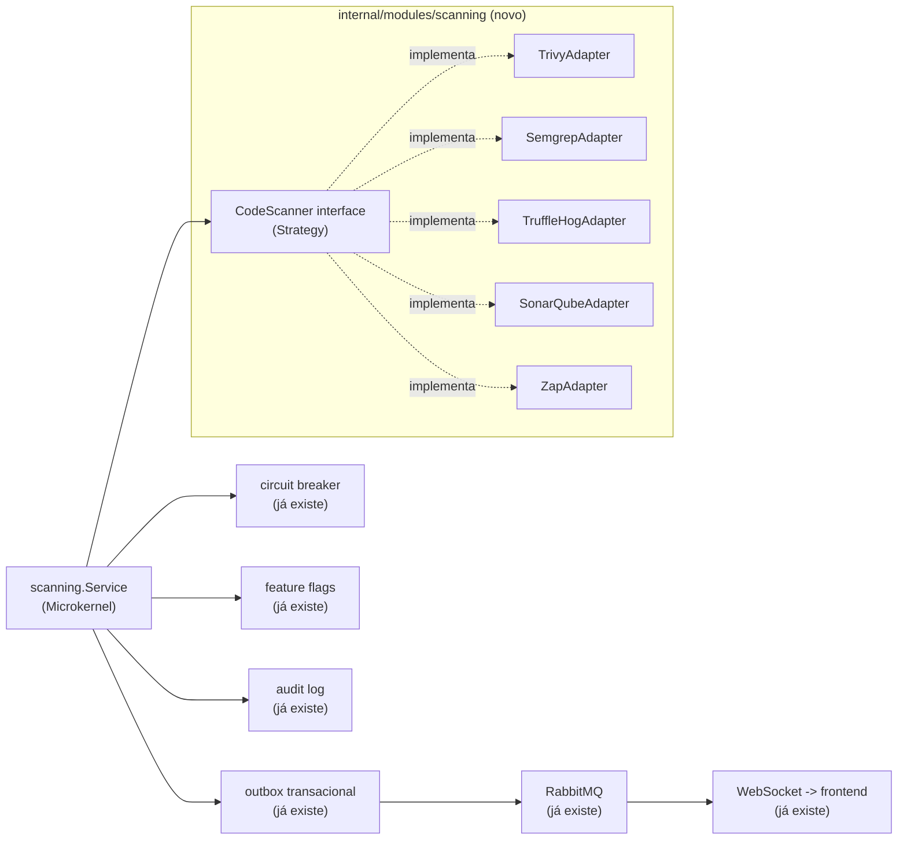

# Roadmap — SecOps Orchestrator: Trivy, Semgrep, TruffleHog, SonarQube e OWASP ZAP como parte do NIX Platform

- **Fase 14 (Maturidade de AppSec — triagem, paginação de verdade, notificação de crítico, postura
  de segurança, exportação CSV) ✅ completa**, sua **continuação (expiração de triagem + tendência
  histórica) ✅ completa**, e a **revisão de exibição de resultados (mestre-detalhe, navegação por
  teclado, link direto por achado, ordenação, barra de severidade, triagem em mais telas) ✅
  completa** — ver as três seções próprias no fim deste documento. RBAC por projeto, fingerprint
  resiliente a deslocamento de linha e exportação SARIF continuam adiados, com o motivo de cada um.
- **Status:** Fases 1, 3-9 concluídas (Fundação, Trivy, Semgrep, SonarQube, OWASP ZAP, Orquestração
  concorrente, CLI + CI/CD, Frontend). Fase 2 (TruffleHog) pulada por decisão explícita do usuário,
  redundante com o gitleaks já no CI (decisão revisitada na Fase 11 abaixo — sob demanda deixou de
  ser redundante). **Fases 10-13 (abaixo) são uma extensão nova**, adaptação de uma segunda
  proposta externa ("Orquestrador de Segurança de Código On-Premise", estilo GitGuard) pra esta
  mesma arquitetura, com 3 decisões explícitas do usuário registradas na seção "Reconciliação" logo
  abaixo. **Fases 10-13 (Projeto + upload .zip; Gitleaks + Syft; snippet + deduplicação; filtro de
  ruído + prompt de IA) TODAS implementadas e verificadas ao vivo — a extensão inteira está
  completa.** **"Containerização"** (uma quarta decisão, posterior às 3 — cada scanner isolado no próprio
  container, como o GitGuard) está **✅ completa**: Trivy, Gitleaks, Syft, Semgrep e agora
  sonar-scanner CLI migrados e **verificados ao vivo** (sidecars `trivy-scanner`/`gitleaks-scanner`/
  `syft-scanner`/`semgrep-scanner`/`sonar-scanner-cli`, volume compartilhado `scanning_workspace`) —
  um scan real com os 4 primeiros simultâneos contra `OWASP/NodeGoat` completou com sucesso total
  (86/3/0/21 achados respectivamente), e um scan separado com `sonar-scanner-cli` contra o mesmo
  alvo completou com **112 achados reais** depois de um achado real corrigido na primeira tentativa
  (ver "sonar-scanner-cli" abaixo, na seção Containerização: os analisadores SonarJS/TS do
  sonar-scanner precisam de um runtime Node.js próprio, não documentado pela SonarSource como
  dependência do CLI — a imagem original também nunca o teve). O SERVIDOR
  SonarQube já era seu próprio container desde a Fase 5 — agora o CLI que faz upload também é.
  `backend-worker` não carrega mais runtime de scanner nenhum: só `git` + o binário Go do worker.
- **Nota de manutenção:** `scanning/application/service.go` foi dividido em `service.go` (núcleo —
  `Service`/`NewService`), `scans.go`, `findings.go` e `projects.go` depois de passar de 1400
  linhas — as referências a `application/service.go` no restante deste documento descrevem o
  estado de quando cada fase foi escrita e continuam válidas como histórico, mesmo que o código
  citado tenha se mudado de arquivo desde então. `scans.go` passou pelo mesmo processo de novo
  (voltou a crescer, 950 linhas): a mecânica de orquestração concorrente (`runConcurrently`,
  `inventoryFor`, `ProcessScanJob`, `HandleScanDeadLetter` e o resto do que suporta o caminho
  assíncrono) está agora em `scan_orchestration.go`; `scans.go` ficou só com o CRUD/status de scan
  jobs. Referências abaixo a essas funções em `application/scans.go` valem como histórico pelo
  mesmo motivo.
- **Origem:** adaptação de uma proposta externa (Core em Go orquestrando ferramentas SecOps via
  Microkernel/Strategy/Adapter/Observer) para a arquitetura real deste repositório.
- **Revisão:** a primeira versão deste documento usava o módulo `secops`/VirusTotal como exemplo
  vivo de cada padrão já implementado. Esse módulo foi removido do produto (decisão do usuário —
  era a única integração "SecOps" real, e o rumo daqui pra frente é o orquestrador desenhado
  abaixo, não um provedor de lookup avulso). Os exemplos abaixo foram trocados para
  `diario_oficial`, o único módulo de integração restante — a arquitetura de plataforma que os
  patterns abaixo reaproveitam (outbox, circuit breaker, feature flags, auditoria) não mudou.

## Por que isto não é um "Core" novo — é uma extensão do que já existe

A proposta original pede um núcleo em Go do zero, gerenciando ferramentas de segurança como
plug-ins. O NIX Platform **já tem a espinha dorsal de plataforma** que isso precisa — o que não
existe mais é um exemplo vivo do papel específico de "Strategy" (não há mais um segundo provedor
plugável hoje, só `diario_oficial`, que fala com um único endpoint fixo) — mas a infraestrutura
em volta continua real e reaproveitável:

| Padrão pedido na proposta | Onde já existe no NIX Platform hoje |
|---|---|
| Strategy Pattern (interface comum por ferramenta) | ✅ Implementado: `scanning/domain/scanner.go` define `CodeScanner`, com `TrivyScanner` (Fase 3) como primeira implementação real registrada — não mais só o `fakeScanner` de teste. |
| Adapter Pattern (normalizar o output de cada ferramenta) | ✅ Implementado, quatro adapters reais: `trivy_scanner.go`, `semgrep_scanner.go`, `sonar_scanner.go` e `zap_scanner.go` traduzem a saída de cada ferramenta pro `domain.Finding` unificado — mesmo princípio que `diario_oficial/infrastructure/http_client.go` já aplicava a um único parceiro. O que os três primeiros têm em comum (clonar o alvo via git, validar SSRF) foi extraído pra `git_clone.go` em vez de duplicado; o `zap_scanner.go` é estruturalmente diferente (ataca um alvo HTTP em vez de ler código-fonte) e por isso não reaproveita esse arquivo — tem sua própria validação (allowlist obrigatória, ver Fase 6). |
| Observer / Event-Driven | Outbox transacional + RabbitMQ (`internal/platform/outbox`, `internal/domain/events`) já publicam `integration.status.changed`, `diario_oficial.job.completed/failed` e, desde a Fase 1/3, `scanning.scan.completed`/`scanning.scan.failed` — o consumer real hoje é só o Hub de WebSocket (`nix.notification.websocket`); nenhuma reação automática a achados CRITICAL/HIGH existe ainda. |
| Microkernel / plug-in registry | ✅ Implementado: `scanning.Service` recebe `...domain.CodeScanner` no construtor e monta um `map[string]CodeScanner` internamente — registrar uma ferramenta nova (Fase 4+) é só passar mais um argumento no wiring de `internal/app/modules.go`, sem tocar em `RunScan`/`ProcessScanJob`. |
| Resiliência (timeout, circuit breaker) | `internal/platform/resilience` (circuit breaker) e `context.Context` com timeout já protegem toda chamada externa — o mesmo mecanismo cobre um scanner novo sem código extra. |
| Interruptor de emergência por ferramenta | `internal/platform/configflags` (feature flags em runtime) já desliga uma integração inteira sem reimplantar — `diario_oficial_scraping_enabled` é o exemplo vivo hoje; cada scanner novo ganha sua própria flag do mesmo jeito. |
| Auditoria de cada execução | `internal/platform/audit` (log imutável) já registra toda ação sensível — cada scan vira uma entrada de auditoria como qualquer outra. |

**A diferença real que exige código novo:** um lookup de "essa entidade é maliciosa? sim/não"
(o que o `secops` removido fazia) cabe num resultado único. Trivy/Semgrep/TruffleHog/SonarQube
devolvem uma **lista** de achados discretos (um scan pode encontrar 40 vulnerabilidades, cada
uma com seu próprio CVE/arquivo/linha/severidade) — um formato estruturalmente diferente, que a
interface `CodeScanner` da Fase 1 já nasce pensando nisso, em vez de tentar encaixar numa forma
de resultado único.

## Arquitetura adaptada

Novo módulo `internal/modules/scanning` (mesmo padrão de pastas de todo módulo já existente:
`domain/application/infrastructure/transport`), com sua própria tabela (`scan_findings`),
suas próprias permissões RBAC (`scanning:read`, `scanning:manage`, seguindo o padrão já usado —
ver `internal/platform/auth/rbac.go`) e reaproveitando toda a plataforma já construída — nada
disso é modificado, só consumido:



`CodeScanner` (a interface nova, Fase 1):

```go
package scanning

type Severity string

const (
    SeverityCritical Severity = "CRITICAL"
    SeverityHigh     Severity = "HIGH"
    SeverityMedium   Severity = "MEDIUM"
    SeverityLow      Severity = "LOW"
)

// Finding é o modelo unificado de achado — todo adaptador converte o
// formato nativo da sua ferramenta (JSON/XML/SARIF) pra isto.
type Finding struct {
    ID          string   // CVE-2026-XXXX, ou uma regra própria (ex.: "semgrep:go.lang.security.audit.sql-injection")
    OWASPCategory string // "A03:2021-Injection", etc. — ver o mapeamento abaixo
    Severity    Severity
    Description string
    File        string // vazio para achados que não são de arquivo (ex.: DAST)
    Line        int
}

// CodeScanner é o contrato que toda ferramenta de scanning implementa —
// desenhado desde já pra "lista de achados" (não um resultado único),
// já que é isso que Trivy/Semgrep/TruffleHog/SonarQube/ZAP produzem.
type CodeScanner interface {
    Name() string
    Execute(ctx context.Context, target string) ([]Finding, error)
}
```

## Fases

Cada fase entrega algo testável e revertível por conta própria — nenhuma depende de todas as
ferramentas estarem prontas para gerar valor.

**Fase 1 — Fundação (sem ferramenta externa nenhuma ainda) — ✅ implementada**
- Migration `scan_findings` (id, scanner, target, owasp_category, severity, description, file,
  line, created_at) — mesmo padrão das tabelas já existentes
  (`migrations/000014_scan_findings.sql`).
- Interface `CodeScanner` + modelo `Finding` (acima) — `scanning/domain/scanner.go`, junto com
  `Repository` (persistência dos achados).
- `scanning.Service` (Strategy + Microkernel): recebe `map[string]CodeScanner` (registrado no
  construtor, um `panic` em nome duplicado — erro de wiring, não condição de runtime), roda um
  scan e grava achados + evento de outbox `scanning.scan.completed` numa única transação
  (`scanning/application/service.go`).
  - **Desvio deliberado do texto acima**: `RunScan` é **síncrono**, não o mesmo desenho
    assíncrono job+outbox+worker de `diario_oficial.Service.CreateTestJob`. O padrão assíncrono
    existe para desacoplar uma requisição HTTP de uma operação lenta via fila — mas esta fase não
    cria nenhum endpoint HTTP nem consumer de fila (ver abaixo), então um job/worker aqui seria
    infraestrutura morta: mensagens publicadas que nada consome. `RunScan` grava achados + evento
    de outbox atomicamente e retorna direto, sem fila no meio. A Fase 2, ao introduzir o primeiro
    scanner real chamado a partir de um endpoint HTTP de verdade, é o momento certo de revisitar
    essa escolha.
- Testado inteiramente com um `fakeScanner`, do mesmo jeito que
  `diario_oficial/application/service_test.go` já testa contra Postgres real com um `fakeClient`
  — nenhuma ferramenta externa precisa estar instalada para esta fase passar no CI
  (`scanning/application/service_test.go`, pulado sem `TEST_DATABASE_URL`).
- RBAC: `scanning:read`/`scanning:manage` adicionadas a `rbac.go`, concedidas a
  `nix-integration-manager` (leitura+gestão) e `nix-auditor` (só leitura) — o mesmo par de roles
  que já cobre integrações, em vez de um role novo só para isto.
- Auditoria: `audit.ActionScanCompleted` (`"scan.completed"`) registrado a cada `RunScan` bem-sucedido — a Fase 3 completou o trio com `ActionScanRequested`/`ActionScanFailed` para o fluxo assíncrono (ver abaixo).
- **Deliberadamente fora desta fase** (chegou na Fase 3, junto com o primeiro scanner real): nenhum
  endpoint HTTP/transport, nenhuma fila/worker RabbitMQ, nenhuma UI no frontend, e o módulo
  `scanning` não estava conectado em `internal/app/modules.go` — sem nenhum `CodeScanner` real
  ainda, conectar um `Service` sem scanner nem chamador teria sido abstração morta (o mesmo
  raciocínio que levou à remoção completa do módulo `secops`/VirusTotal). Ver Fase 3 abaixo para
  onde cada uma dessas peças foi de fato construída.

**Fase 2 — TruffleHog (secret scanning) — ⏭️ pulada por decisão do usuário**
- O CI deste projeto já roda [gitleaks](https://github.com/gitleaks/gitleaks)
  (`.github/workflows/gitleaks.yml`) — a mesma categoria de ferramenta que o TruffleHog. Diante da
  redundância, o usuário escolheu explicitamente ir direto para a Fase 3 (Trivy) em vez de adotar
  TruffleHog e aposentar o gitleaks. Fica registrada como decisão tomada, não como observação em
  aberto — se algum dia fizer sentido revisitar (ex.: TruffleHog cobre verificação ativa contra
  provedores conhecidos, gitleaks só regex), é aqui que essa fase retomaria.

**Fase 3 — Trivy (dependências, Dockerfiles) — ✅ implementada**
- **A suposição original desta fase estava errada e foi corrigida durante a implementação**: o
  texto original assumia que dava pra "reaproveitar o mesmo binário/imagem" que o Trivy já usa no
  CI. Investigando antes de implementar, descobriu-se que isso não é viável em produção: o
  `backend-worker` roda numa imagem Alpine mínima sem o código-fonte do repositório, sem acesso ao
  daemon Docker, e o CI nunca publica as imagens construídas em nenhum registry — não há de onde
  ler um Dockerfile ou uma imagem em tempo de execução sem antes obter o código de algum lugar.
  Perguntado sobre isso, o usuário escolheu explicitamente: **clonar o alvo via git** para um
  diretório temporário no worker e rodar `trivy fs` nele — em vez de montar o socket do Docker
  (superfície de ataque equivalente a root no host) ou publicar imagens num registry (escopo maior
  antes do Trivy em si funcionar).
- `TrivyScanner` (`backend/internal/modules/scanning/infrastructure/trivy_scanner.go`): alvo é
  `"<url-git-https>[#branch-ou-tag]"` — só `https://` é aceito (bloqueia `file://`, que permitiria
  ler qualquer caminho local do worker, e `ssh://`, que exigiria gerenciar uma chave privada), e o
  prefixo obrigatório garante por construção que o valor nunca começa com `-`, prevenindo injeção
  de argumento no `git`/`trivy` via `os/exec` (nunca via shell, mas real do mesmo jeito). Roda
  `trivy fs --scanners vuln,misconfig` (sem `secret` — gitleaks já cobre essa categoria no CI,
  mesmo raciocínio que decidiu a Fase 2 acima). Verificado de ponta a ponta contra um repositório
  público real (`OWASP/NodeGoat`) com 86 achados reais parseados corretamente.
- **A10 SSRF, corrigido durante a implementação**: este endpoint é o primeiro da plataforma a
  aceitar uma URL do chamador (o `target` git) — `validateHost` resolve o hostname e rejeita
  qualquer IP privado/loopback/link-local/não especificado antes de clonar, para que
  `scanning:manage` não vire um jeito de sondar/alcançar hosts internos a partir do worker. Defesa
  em profundidade, não uma proteção completa (o `git`, um processo separado, re-resolve o host de
  novo ao conectar de verdade — uma resposta de DNS que mude entre a checagem e essa conexão
  passaria batido), aceita como suficiente hoje porque quem chama já precisa do mesmo nível de
  confiança de qualquer outra ação administrativa de integração na plataforma. Ver a linha A10 na
  tabela OWASP abaixo.
- `git` instalado na imagem do `backend-worker` (nunca na do `backend-api`) — `trivy` em si **saiu**
  dessa imagem numa fase posterior (ver "Containerização" abaixo: o binário ganhou seu próprio
  container, `trivy-scanner`, chamado via HTTP). O checksum SHA-256 do binário contra o
  `checksums.txt` publicado pelo próprio projeto Trivy continua verificado antes de instalar —
  integridade de supply chain (A08:2021) — só que agora no `Dockerfile.trivy-sidecar`, não mais
  aqui.
- **Desvio deliberado do padrão síncrono da Fase 1**: com um scanner real e lento (clone + scan
  pode levar de segundos a minutos) chamado por HTTP de verdade, o par
  `CreateScanJob`/`ProcessScanJob` (mesmo desenho job+outbox+worker de
  `diario_oficial.Service.CreateTestJob`/`ProcessJob`) substitui a chamada síncrona só para o
  caminho HTTP — `RunScan` continua existindo, síncrono, para quem quiser chamar um scanner
  diretamente sem depender de fila (testes, uma futura execução agendada que já roda no worker).
  `POST /api/v1/scanning/scans` retorna 202 imediatamente; o `job_id` retornado é o mesmo `scan_id`
  usado depois em `GET /api/v1/scanning/scans/{scanID}/findings`.

**Fase 4 — Semgrep (SAST) — ✅ implementada**
- `SemgrepScanner` (`backend/internal/modules/scanning/infrastructure/semgrep_scanner.go`):
  exatamente como no exemplo da proposta original (`os/exec` chamando `semgrep scan --json`),
  convertendo pra `[]Finding`. Regras: `p/owasp-top-ten` (registry público, mantido pela
  comunidade Semgrep) como padrão, configurável via `SCANNING_SEMGREP_CONFIG`.
- **Reaproveitamento em vez de duplicação**: o mesmo alvo/mecânica do Trivy (clonar via git pra um
  diretório temporário) valia igualmente aqui — em vez de copiar `parseTarget`/`validateHost`
  (a defesa de SSRF da Fase 3) pro adapter novo, essa lógica foi extraída pra
  `git_clone.go`, compartilhada pelos dois scanners. Duplicar uma checagem de segurança em dois
  lugares é como ela diverge silenciosamente com o tempo — extrair antes do segundo uso evitou
  isso.
- **Duas descobertas reais ao integrar com a saída de verdade do Semgrep** (verificado rodando
  contra `OWASP/PyGoat`, um app Python deliberadamente vulnerável, não assumido da documentação):
  1. O campo `extra.metadata.owasp` tem **tipo inconsistente** entre regras da comunidade — às
     vezes uma lista de strings (`["A03:2021 - Injection", "A05:2025 - Injection"]`), às vezes uma
     string única (`"A06:2017 - Security Misconfiguration"`). `firstOWASPCategory` decodifica os
     dois formatos via `json.RawMessage`.
  2. `path` no resultado do Semgrep é **absoluto** (`/tmp/nix-scan-xxx/app.py`), ao contrário do
     `Target` do Trivy (já relativo) — `relativeToScanDir` corrige isso antes de gravar em
     `Finding.File`, pra nunca persistir um caminho efêmero que não significa nada fora da
     execução do scan.
- Severidade: o engine OSS do Semgrep só emite `ERROR`/`WARNING`/`INFO` (sem `CRITICAL` nativo,
  confirmado contra a saída real) — mapeado pra `HIGH`/`MEDIUM`/`LOW` respectivamente.
- `backend/Dockerfile.worker`: Python3 + pip + Semgrep instalados numa venv isolada só na imagem
  do worker. Diferença real de postura em relação ao Trivy, documentada no próprio Dockerfile: o
  Semgrep não publica um tarball com checksum próprio como o Trivy — a integridade aqui vem da
  cadeia padrão do pip contra o PyPI (TLS + hash por pacote), não de uma verificação explícita.
  Custo operacional real: a imagem do worker cresce de ~150MB pra **~916MB** com o runtime Python
  completo do Semgrep — aceito por ora; SonarQube (Fase 5) já é sinalizado como a fase de maior
  custo de infraestrutura da lista, mas o Semgrep também não é gratuito nesse sentido.

**Fase 5 — SonarQube (qualidade de código, bugs) — ✅ implementada**
- **Decisão de infraestrutura, explícita do usuário**: self-hosted via Docker Compose (não
  SonarCloud) — a única fase que não é "só chamar um binário." `docker-compose.yml` ganhou dois
  serviços novos: `sonarqube-db` (PostgreSQL dedicado — nunca compartilha schema com o `postgres`
  da aplicação, o SonarQube gerencia suas próprias migrations internamente) e `sonarqube`
  (`sonarqube:26.8.0.126808-community`, imagem pinada). Requisito documentado do próprio SonarQube
  (bootstrap check do Elasticsearch embutido): o host precisa de `vm.max_map_count >= 262144`
  (`sysctl -w vm.max_map_count=262144`) — não é namespaced por container, não dá pra setar via
  compose.
- **Diferença estrutural real em relação a Trivy/Semgrep, descoberta implementando**: os dois
  primeiros scanners rodam do início ao fim e devolvem o resultado completo no próprio stdout. O
  SonarQube é assíncrono em DOIS níveis — o `sonar-scanner` CLI só faz upload do relatório e
  retorna; o processamento de verdade (a "Compute Engine" do servidor) roda depois, em segundo
  plano. `SonarScanner.Execute`
  (`backend/internal/modules/scanning/infrastructure/sonar_scanner.go`) por isso: (1) roda o CLI
  (reaproveitando `cloneShallow`, a mesma validação de alvo/SSRF de Trivy/Semgrep), (2) lê o
  `ceTaskId` que o CLI grava em `.scannerwork/report-task.txt` (formato confirmado rodando contra
  um servidor real — não documentado explicitamente pelo SonarQube), (3) faz polling em
  `GET /api/ce/task?id=...` até `SUCCESS`/`FAILED`/`CANCELED`, e só então (4) busca os achados via
  `GET /api/issues/search`.
- **sonar-scanner CLI num runtime musl**: a imagem oficial `sonarsource/sonar-scanner-cli` é
  baseada em Amazon Linux (glibc) — copiar os binários nativos dela pra cima do Alpine (musl) do
  worker quebraria. Em vez disso, um estágio de build extra só extrai o JAR/script de shell
  portáveis dessa imagem (nenhum binário nativo), e o runtime final instala sua PRÓPRIA JRE nativa
  Alpine (`openjdk21-jre-headless`) — verificado rodando como o usuário `nix` não-root de verdade
  contra um servidor SonarQube real, sem erro de permissão.
- **Duas descobertas reais consultando a API do servidor de verdade** (não assumidas de
  documentação): (1) `/api/hotspots/search` exige uma permissão de leitura de projeto diferente da
  que um `GLOBAL_ANALYSIS_TOKEN` concede ("Insufficient privileges") — deliberadamente não
  buscado; hotspots exigem revisão humana pra decidir se são um problema de verdade, então tratá-los
  como `Finding` automático misrepresentaria "precisa de triagem" como "problema confirmado". (2)
  Esta versão (26.8, Community Edition) **não expõe mais um campo estruturado de mapeamento
  OWASP/CWE** em `/api/rules/show` nem `/api/rules/search` (só texto livre em HTML) — ao contrário
  do Trivy/Semgrep, `Finding.OWASPCategory` fica sempre vazio para achados do SonarQube.
  `project key` é derivado deterministicamente do alvo (mesmo repositório → mesmo projeto no
  SonarQube, histórico de análise acumulado entre scans).
- Severidade: escala legada de 5 níveis do SonarQube (BLOCKER/CRITICAL/MAJOR/MINOR/INFO, ainda o
  campo `severity` de todo issue na API atual) mapeada pra CRITICAL/CRITICAL/HIGH/MEDIUM/LOW.

**Fase 6 — OWASP ZAP (DAST) — ✅ implementada**
- **Maior risco de todas as fases, decisão explícita do usuário antes de implementar**: sem
  ambiente de staging/homologação real disponível, a verificação de ponta a ponta usou um alvo
  local — não um alvo público de teste (`testphp.vulnweb.com`, o candidato óbvio, mostrou-se
  inalcançável a partir deste ambiente durante a implementação; substituído por OWASP Juice Shop e
  nginx rodando localmente na mesma rede, especificamente pra este fim).
- **Diferença estrutural fundamental em relação a Trivy/Semgrep/SonarQube, refletida no próprio
  desenho do código**: os três primeiros só LEEM código-fonte — nunca interagem com o alvo além de
  clonar/enviar um relatório. O `ZapScanner`
  (`backend/internal/modules/scanning/infrastructure/zap_scanner.go`) ATIVAMENTE ATACA um serviço
  rodando de verdade (spider/crawl seguido de scan ativo — injeção, XSS, etc. — via a API REST de
  um daemon OWASP ZAP self-hosted, `docker-compose.yml` serviço `zap`). Por isso o alvo NUNCA passa
  por `cloneShallow`/`validateHost` (a defesa de SSRF dos outros três não faz sentido aqui — um IP
  privado é frequentemente o alvo LEGÍTIMO, um staging interno); a defesa central é uma
  **allowlist de hosts explícita e obrigatória** (`SCANNING_ZAP_ALLOWED_HOSTS`) — vazia por
  padrão, o oposto do "aberto por padrão" das outras validações desta plataforma: TODO alvo é
  recusado até um host de staging ser explicitamente autorizado. Nunca produção — regra
  inegociável, imposta em código (`validateTarget`), não só em documentação.
- **Descoberta real ao integrar com a API de um daemon real**: ao contrário do Trivy/Semgrep/
  SonarQube, o ZAP expõe um mapeamento OWASP Top 10 **estruturado de verdade** — cada alerta carrega
  tags como `OWASP_2021_A01` cujo valor é uma URL
  (`https://owasp.org/Top10/A01_2021-Broken_Access_Control/`), da qual `zapOWASPCategory` deriva o
  mesmo formato `"A01:2021-Broken Access Control"` que Trivy/Semgrep já usam. Um mesmo alerta pode
  carregar tags de 2017/2021/2025 simultaneamente (verificado contra a saída real) — só a 2021 é
  usada, pra bater com a edição que todo o resto deste roadmap já usa.
- Severidade: escala de 4 níveis do ZAP (High/Medium/Low/Informational — sem um nível acima de
  High, mesmo raciocínio que fez o Semgrep não usar CRITICAL) mapeada pra HIGH/MEDIUM/LOW/LOW.
- `docker-compose.yml`: serviço `zap` (`zaproxy/zap-stable:2.17.0`, daemon com API REST, autenticado
  por `api.key` obrigatório — sem chave, qualquer container na mesma rede poderia disparar
  ataques). Ao contrário de trivy/semgrep/sonar-scanner (processos rodados dentro do worker), o ZAP
  roda como um serviço de vida longa; o worker fala com a API dele via HTTP.

**Fase 7 — Orquestração concorrente — ✅ implementada**
- `POST /api/v1/scanning/scans` aceita `scanners` como uma **lista**, não mais um único nome — pedir
  mais de um (ex.: `["trivy","semgrep","sonarqube"]`) dispara todos em paralelo contra o mesmo
  alvo, sob o mesmo job/`scan_id`. Achados de todos os scanners bem-sucedidos ficam consultáveis
  juntos via `GET /api/v1/scanning/scans/{scanID}/findings`, cada um com seu próprio `scanner` no
  achado (já existia essa coluna — nenhuma migration nova precisou entrar).
- **Desvio deliberado do texto literal do roadmap**: `ProcessScanJob` usa `goroutines` +
  `sync.WaitGroup`, não o pacote `errgroup` como o texto original sugeria. Motivo: o comportamento
  padrão de `errgroup.Group.WithContext` cancela o contexto do grupo INTEIRO assim que o primeiro
  `Go()` retorna erro — exatamente o oposto do que esta fase pede ("cancelando um scanner que trava
  sem derrubar os outros"). Evitar esse cancelamento cruzado não é cosmético, é o que garante a
  independência entre scanners. Cada scanner já limita seu próprio tempo de execução por dentro
  (`CloneTimeout`, `SonarQubeAnalysisTimeout`, `ZapScanTimeout`) — não precisava de mais um nível de
  timeout aqui.
- **Falha parcial não é reprocessada**: se `N-1` de `N` scanners tiverem sucesso, o job é marcado
  `completed` (não `failed`) — reprocessar o job inteiro numa redelivery do RabbitMQ re-executaria
  também os scanners que JÁ tiveram sucesso, arriscando achados duplicados gravados sob o mesmo
  `scan_id`. O(s) scanner(s) que falhou(aram) fica(m) registrado(s) no `result` do job e nos
  metadados de auditoria (`failed_scanners`), nunca silenciosamente perdido(s). Só quando TODOS os
  scanners de um job falham é que o job inteiro é marcado `failed` para retry — mesma semântica de
  antes desta fase, agora generalizada pra N scanners em vez de 1.
- Testado com um scanner que bloqueia deliberadamente (prova de paralelismo real, não só "roda sem
  erro"), sucesso total, falha parcial (achados do scanner bem-sucedido persistidos, nada do que
  falhou) e falha total (job marcado pra retry) — `application/service_test.go`, mais um teste de
  ponta a ponta na camada de transporte confirmando os dois `scanner` distintos aparecendo juntos
  na resposta HTTP.

**Fase 8 — CLI + CI/CD — ✅ implementada**
- `cmd/secscan` (mesmo padrão de `cmd/api`/`cmd/worker`), chamável como
  `nix-secscan scan --repo . --scanners trivy,semgrep --fail-on HIGH` (ou `make secscan`). Ao
  contrário de `cmd/api`/`cmd/worker`, deliberadamente NÃO reaproveita `internal/app.NewDependencies`
  (que exige Postgres/RabbitMQ/Keycloak configurados) nem o padrão job+outbox+worker — é um binário
  standalone, síncrono, pra rodar uma vez e sair com um exit code (0 limpo, 1 achado no limiar de
  `--fail-on` ou mais grave, 2 erro de uso/ferramenta) que um pipeline de CI usa como gate.
- **Escopo desta fase, deliberado**: só `trivy` e `semgrep` — os dois únicos scanners que leem um
  diretório local sem depender de um servidor externo já no ar (`sonarqube` exige um servidor
  rodando e credenciais; `zap` nem se aplica, ataca um serviço vivo, não lê um diretório).
  `TrivyScanner`/`SemgrepScanner` ganharam um método novo, `ExecuteLocal(ctx, dir)`, que reaproveita
  a MESMA lógica de scan/parsing/mapeamento OWASP de `Execute` (usada pelo módulo `scanning` via
  HTTP) — só pula o `cloneShallow` (clonar de uma URL remota), já que o repositório já está no
  disco. Nenhuma duplicação de lógica entre o CLI e o módulo HTTP.
- **"Unifica" no sentido literal do roadmap**: `secscan` é um job NOVO e ADICIONAL em `ci.yml`
  (`--fail-on CRITICAL`, deliberadamente conservador pra não quebrar CI à toa) — os 4 jobs
  originais (govulncheck, npm audit, Trivy de imagem, gitleaks/CodeQL) continuam exatamente como
  estavam, nenhum removido. O valor real e imediato é reprodutibilidade local: `make secscan` roda
  o mesmo comando que o CI antes mesmo de abrir um PR.
- **Descoberta real testando** (não hipotética): rodar o CLI contra um checkout SEM git funcionando
  de verdade (ex.: um bind mount Docker com "dubious ownership") faz o semgrep perder sua
  consciência de `.gitignore` por padrão (`--use-git-ignore`, o comportamento default) e escanear
  artefatos de build tipo `frontend/.next` — ruído de código gerado/minificado, não código-fonte.
  `actions/checkout` no CI e um clone local normal sempre preservam a propriedade/o git funcional,
  então isto nunca acontece na prática — documentado no próprio `cmd/secscan/main.go` como uma
  premissa explícita, não contornado com flags de exclude extras que mascarariam o problema em vez
  de indicar que algo está errado com o checkout.
- Rodando `nix-secscan` contra o próprio NIX Platform, achados reais e genuínos apareceram — não
  simulados: `GO-2026-5932` (pacote `golang.org/x/crypto/openpgp`, não mantido, LOW) no
  `backend/go.mod`, `Dockerfile`s sem `HEALTHCHECK` (LOW), e — rodando contra `.github/workflows/`
  — toda action do próprio CI usando uma tag mutável (`@v4` em vez de um SHA de commit fixo,
  MEDIUM, um risco real de supply chain) e o `dependabot.yml` sem período de espera (`cooldown`)
  configurado. Nenhum desses foi corrigido nesta fase (fora de escopo — Fase 8 é sobre construir a
  ferramenta, não sanear todo achado que ela encontra), mas ficam registrados aqui como
  recomendações reais e verificadas pra quando fizer sentido agir sobre elas.

**Fase 9 — Frontend — ✅ implementada**
- Nova rota `/seguranca` (menu próprio na Sidebar, ícone `ShieldAlert`) — uma **seção própria**, não
  uma aba dentro de `/integracoes` (a opção que o roadmap deixava em aberto): dado o tamanho que o
  módulo `scanning` já tinha ganhado (quatro scanners reais, RBAC própria), o mesmo raciocínio que já
  tinha separado Integrações de Configurações nesta plataforma se aplicava aqui. Server Component
  puro (`app/(protected)/seguranca/page.tsx` + `loading.tsx`), reaproveitando `Table`/`Badge`/
  `EmptyState`/`ErrorState` do kit de UI já existente — nenhum componente novo além de um
  `SeverityBadge` fino (`Badge` com o tom mapeado por severidade), zero design novo.
- **Gap real de backend descoberto implementando**: o roadmap pede "achados recentes por
  severidade", mas até esta fase só existia `GET /api/v1/scanning/scans/{scanID}/findings`
  (escopado a um `scan_id` já conhecido) — nada permitia descobrir quais achados existem sem
  primeiro saber o `scan_id`. Endpoint novo: `GET /api/v1/scanning/findings?limit=N` (default 50,
  teto rígido 200), consultando `scan_findings` sem filtro de `scan_id`, mesma ordenação por
  severidade/data. RBAC reaproveitada (`scanning:read`, já existente).
- **`TriggerScanForm`, adicionado logo em seguida a pedido explícito do usuário** ("como
  mostraremos pra aplicação onde atacaremos?"): a versão original desta fase só listava achados,
  deliberadamente sem formulário de disparo. Um Client Component (`components/scanning/
  TriggerScanForm.tsx`) embutido na mesma página Server Component — seleção de scanner(s) via
  `Toggle` + campo de alvo via `Input`, `POST /api/v1/scanning/scans` pelo mesmo `apiClient`/proxy
  BFF que `IntegrationCard` já usa pro botão "Testar conexão". Explica no próprio texto do
  formulário a diferença de formato de alvo (URL git pros três primeiros scanners, URL http(s) de
  um serviço rodando pro ZAP) e que o ZAP só ataca um host já na allowlist
  (`SCANNING_ZAP_ALLOWED_HOSTS`).
- `NotificationCenter` ganhou tratamento para `scanning.scan.completed`/`scanning.scan.failed` —
  um gap real encontrado ao verificar o disparo pela UI: esses eventos já eram publicados desde a
  Fase 1, mas o frontend nunca tinha um toast pra eles. `scanning.scan.completed` tem tratamento
  próprio (como `integration.status.changed`) porque seu payload carrega `scan_id`, não `job_id`
  como o schema genérico de evento de job espera.
- Verificado de ponta a ponta contra o app de verdade: login real via NextAuth (fluxo de
  credenciais, não simulado), scan real disparado via API, página `/seguranca` buscada autenticada
  — achados reais (CVEs do OWASP/NodeGoat) renderizados com selo de severidade correto (43 CRITICAL,
  57 HIGH confirmados na resposta HTML) — e, depois, o formulário de disparo verificado pelo MESMO
  caminho que o clique do usuário percorre (proxy BFF autenticado por cookie de sessão, não um
  bearer token direto), criando um job real de verdade.

## Extensão — Projetos persistentes, Gitleaks, Syft, viewer de código, prompt de IA

Segunda proposta externa (ver histórico de conversa), desta vez inspirada no GitGuard: uma
aplicação "on-premise" com repositórios mantidos permanentemente em disco, upload de `.zip`,
suporte a repositório privado via PAT, 4 motores (Semgrep/Trivy/Gitleaks/Syft), deduplicação por
fingerprint, viewer de código-fonte na UI e um botão "copiar prompt pra IA" por achado. Boa parte
já existe (ver tabela); o resto é adaptado abaixo — nunca implementado literalmente como a proposta
descreve quando isso colidia com uma decisão de arquitetura já tomada e documentada neste roadmap.

### O que a proposta pede que já existe hoje, sem mudança nenhuma

| Pedido da proposta | Onde já existe |
|---|---|
| Orquestração paralela de scanners via goroutines | ✅ `runConcurrently` (Fase 7) — e mais robusto que o texto da proposta: `sync.WaitGroup` puro, não `errgroup` (ver Fase 7, o cancelamento cruzado do `errgroup` seria regressão) |
| Severidade normalizada CRITICAL/HIGH/MEDIUM/LOW | ✅ `domain.Severity`, desde a Fase 1 — a MESMA escala que a proposta pede |
| Ferramenta de origem + arquivo:linha em cada achado | ✅ `Finding.Scanner`/`File`/`Line`, desde a Fase 1 |
| "Card mostra qual ferramenta achou, tipo de erro, como corrigir" | ✅ `remediationHint`/`ScannerFailureCard`/`FindingsTable` (sessão anterior) — inclusive já com link "abrir na ferramenta" (`ToolResponse.URL`), algo que a proposta nem pede |
| Rodar scanner direto contra um diretório LOCAL (sem clonar) | ✅ `TrivyScanner.ExecuteLocal`/`SemgrepScanner.ExecuteLocal` (Fase 8, `cmd/secscan`) — exatamente o método que as Fases 11/12 abaixo reaproveitam pra ler do disco em vez de clonar de novo |
| Interface comum por ferramenta (Strategy) | ✅ `domain.CodeScanner` — Gitleaks/Syft (Fase 11) são só mais dois adapters, mesmo padrão de `TrivyScanner`/`SemgrepScanner` |

### Reconciliação — as 3 decisões do usuário

1. **Armazenamento em disco:** a proposta pede repositórios persistidos permanentemente em
   `./storage/repos/{project_id}`, com `git pull` pra re-scan. **Decisão: não.** O worker sempre
   clona pra um diretório TEMPORÁRIO e apaga logo depois de cada scan (`cloneShallow`,
   `git_clone.go`) — deliberado desde a Fase 3, e o motivo continua válido: o worker já é desenhado
   pra escalar horizontalmente via consumer RabbitMQ (múltiplas réplicas), e "qual réplica tem a
   pasta de qual projeto no disco local dela" é um problema de estado que checkout persistente
   introduziria sem necessidade — resolvê-lo direito exigiria storage compartilhado em rede (EFS/NFS
   ou similar), escopo bem maior que o valor real do pedido ("re-scan mais rápido"). Em vez disso: a
   **Fase 10** abaixo introduz "Projeto" como um registro leve (nome, alvo, histórico de scans) —
   sem persistir o checkout em si. Um re-scan continua clonando do zero (o mesmo custo de rede que
   todo scan já paga hoje, pequeno pra shallow clone) — só ganha a conveniência de não precisar
   colar a URL de novo.
2. **PAT / repositório privado:** a proposta pede um campo de Personal Access Token pra clonar
   repositórios privados. **Decisão: não, por enquanto.** Aceitar credencial do usuário é uma
   superfície de segurança nova que este roadmap nunca teve (guardar segredo com segurança, nunca
   deixar vazar em log/mensagem de erro do `git`, decidir quem pode ver/rotacionar) — desproporcional
   ao resto da proposta, que dá pra entregar inteiro sem isso. `parseGitTarget` continua exigindo
   `https://` público, exatamente como hoje (Fase 3). Fica registrado aqui como possível fase futura,
   não como esquecimento.
3. **Gitleaks e Syft:** a proposta pede os dois. O roadmap já tinha decisão explícita contra ambos —
   Gitleaks pulado na Fase 2 (redundante com o gitleaks do CI) e SBOM listado em "Fora de escopo"
   (abaixo) como "projeto à parte". **Decisão: adicionar os dois agora**, revisitando as duas
   decisões — o contexto mudou: CI gitleaks só cobre o que está em PRs/commits deste próprio
   repositório; um Gitleaks sob demanda pela UI do orquestrador cobre QUALQUER alvo que o usuário
   aponte, o mesmo raciocínio que já vale pra Trivy/Semgrep/SonarQube não serem "redundantes" com o
   CI mesmo o CI já rodando `govulncheck`/`npm audit`. Ver Fase 11.

### Containerização — cada scanner isolado no próprio container — 🟡 parcial (Trivy, Gitleaks e Syft feitos)

Decisão do usuário, depois das 3 acima: **"o gitguard usa cada solução containerizada, vamos fazer
do mesmo jeito"**. Antes desta decisão, Trivy/Semgrep/(sonar-scanner CLI) rodavam como binários
instalados DENTRO da imagem do `backend-worker`, chamados via `os/exec` — SonarQube e ZAP já eram
diferentes (serviços de vida longa próprios, `docker-compose.yml`), mas por acaso de arquitetura
(os dois precisam mesmo de um servidor), não por uma decisão deliberada de isolamento. Agora é
deliberado: **todo scanner vira um serviço próprio**, um container isolado com API HTTP fina na
frente — o mesmo padrão que SonarQube/ZAP já tinham, generalizado.

**Por que não montar o socket do Docker** (a forma mais óbvia de fazer o worker literalmente rodar
`docker run trivy ...`): a Fase 3 já rejeitou isso explicitamente pro caso de ler imagens Docker —
"superfície de ataque equivalente a root no host". O mesmo raciocínio vale igual aqui; escolhido em
vez disso o desenho abaixo, que nunca dá ao worker acesso ao Docker em si.

**Desenho, estabelecido implementando o Trivy (o primeiro, referência pros próximos)**:
- Volume Docker nomeado novo, `scanning_workspace`, montado em `/workspace` — leitura+escrita no
  `backend-worker` (que continua sendo o único dono do ciclo de vida: cria o diretório antes do
  scan, apaga depois), **somente leitura** em cada sidecar de scanner (defesa em profundidade: um
  sidecar comprometido não consegue adulterar o clone que outro scanner ainda vai ler).
- `cloneShallow` (`git_clone.go`, compartilhada entre Trivy/Semgrep/SonarQube) ganhou um parâmetro
  `baseDir` — `""` continua o padrão de sempre (diretório temporário do próprio SO, usado por
  Semgrep/SonarQube, ainda não containerizados); só `TrivyScanner.Execute` passa
  `ScanningConfig.ScanningWorkspaceDir` (`/workspace` em produção), pra clonar dentro do volume
  compartilhado em vez do filesystem privado do worker.
- Sidecar novo, `cmd/trivy-sidecar` (`backend/Dockerfile.trivy-sidecar`, serviço `trivy-scanner` no
  `docker-compose.yml`): um servidor HTTP fino — `POST /scan {"path": "..."}` roda
  `trivy fs --format json ...` contra esse path e devolve o JSON NATIVO do trivy, sem reinterpretar
  nada. Recusa (400) qualquer `path` fora de `/workspace` — nunca confia cegamente no que a rede
  interna mandou, mesma postura de `validateHost` pro alvo git. Todo o parsing/mapeamento
  OWASP/normalização de severidade (`parseTrivyReport`) continua em `trivy_scanner.go`, no worker —
  nunca duplicado no sidecar.
- `TrivyScanner.Execute` (produção, via worker) chama o sidecar por HTTP;
  `TrivyScanner.ExecuteLocal` (`cmd/secscan`, o CLI standalone da Fase 8) continua rodando o binário
  local via `os/exec`, sem depender de rede nenhuma — os dois caminhos convergem no mesmo
  `parseTrivyReport`, então o formato do achado nunca diverge entre eles.
- **Achado real durante a implementação**: um volume Docker nomeado novo nasce `root:root` — o
  worker (rodando como usuário não-root `nix`) não conseguia criar o diretório do clone
  (`permission denied`), reproduzido ao vivo contra um scan de verdade antes de corrigir. Fix: os
  dois Dockerfiles (`Dockerfile.worker` e `Dockerfile.trivy-sidecar`) passaram a usar um UID/GID
  FIXO (`10001`), idêntico nos dois, e pré-criam `/workspace` com essa ownership ANTES do volume ser
  montado — Docker copia a ownership que já existe nesse caminho dentro da imagem pro volume vazio
  na primeira vez que ele é montado, então qualquer um dos dois containers pode ser o primeiro a
  subir sem deixar o volume com o dono errado.
- Verificado ao vivo, ponta a ponta: um scan de verdade contra `OWASP/NodeGoat` via o sidecar achou
  os MESMOS 86 achados que a Fase 3 original (antes da containerização) já tinha registrado — prova
  de que a migração não mudou nenhum resultado, só onde o binário roda. O caminho de erro também
  verificado (alvo inexistente) — a mensagem real do `git clone` (capturada no worker, antes de
  qualquer chamada ao sidecar) continua chegando íntegra até a UI.
- Imagem do `backend-worker` caiu de ~982MB pra bem menos sem o binário do trivy (na época, ainda
  carregava semgrep+sonar-scanner+JRE). **Medido ao vivo** (sessão que containerizou
  Semgrep+sonar-scanner CLI, com Docker disponível), tamanhos finais de todas as imagens de
  scanning: `backend-worker` **62.5MB** (só `git` + o binário Go do worker — nenhum runtime de
  scanner a mais, depois de extrair também o sonar-scanner CLI, o último a sair), `trivy-scanner`
  **243MB**, `syft-scanner` **139MB**, `gitleaks-scanner` **53.8MB**, `semgrep-scanner` **658MB**
  (quase todo runtime Python do próprio semgrep — esperado, era o maior contribuinte pro salto de
  ~150MB pra ~916MB do worker já registrado na Fase 4; isolar num container próprio não reduz esse
  peso, só tira do worker principal) e `sonar-scanner-cli` **385MB** (JRE + a JAR do scanner +
  Node.js, ver achado real na seção "sonar-scanner-cli" abaixo). `backend-api`, que nunca carregou
  nenhum runtime de scanner, continua em ~46MB.

**Gitleaks e Syft (Fase 11) já nasceram seguindo este mesmo desenho**, sem precisar de uma migração
posterior: `cmd/gitleaks-sidecar`/`Dockerfile.gitleaks-sidecar`/serviço `gitleaks-scanner` e
`cmd/syft-sidecar`/`Dockerfile.syft-sidecar`/serviço `syft-scanner`, mesmo UID/GID fixo (`10001`)
em todos os Dockerfiles, mesma validação de path dentro de `/workspace`. Syft é o único caso em que
o método chamado pelo Service não é `Execute` — é `Inventory` (`domain.InventoryProvider`, ver Fase
11 abaixo), já que `Execute` em si nunca faz nada pra este scanner. Ver Fase 11 abaixo pro que só o
Gitleaks precisou de ajuste (o achado real do path com o diretório de clone embutido, corrigido em
`parseGitleaksReport`).

**Semgrep migrado pro mesmo padrão** (`semgrep_scanner.go`): sidecar `semgrep-scanner`
(`cmd/semgrep-sidecar`, `Dockerfile.semgrep-sidecar`), mesmo esqueleto Execute/ExecuteLocal/
scanRemote de Trivy/Gitleaks, mesmo UID/GID fixo (`10001`), mesma validação de path dentro de
`/workspace`. Única diferença real de contrato: o corpo da requisição HTTP também carrega
`config` (o ruleset do Semgrep Registry) — Trivy/Gitleaks/Syft têm argumentos fixos no sidecar, o
Semgrep não, então o ruleset continua decidido pelo worker (`SCANNING_SEMGREP_CONFIG`) a cada
chamada, em vez de fixado na imagem do sidecar.

**✅ Verificado ao vivo** (sessão seguinte, com Docker disponível): as 5 imagens (`semgrep-scanner`
+ `backend-worker`/`backend-api` reconstruídos) buildaram limpo; os 4 sidecars (`trivy-scanner`,
`gitleaks-scanner`, `syft-scanner`, `semgrep-scanner`) subiram saudáveis. Um scan real via
`POST /api/v1/scanning/scans` (login local, `admin`/`Admin123!`) contra `OWASP/NodeGoat` com os 4
scanners simultâneos completou com sucesso total — `trivy`: 86 achados (o MESMO número já
registrado na Fase 3/Containerização original, confirmando que a migração do Semgrep não teve
efeito colateral nenhum nos outros três), `gitleaks`: 3, `syft`: 0 achados de vulnerabilidade (SBOM
puro, esperado — `Execute` do Syft é sempre no-op), `semgrep`: **21 achados reais**, incluindo
`javascript.lang.security.audit.code-string-concat.code-string-concat` (A03:2021-Injection,
`app/routes/contributions.js`, `eval(req.body.preTax)`) com snippet/fingerprint/link pro Semgrep
Registry corretos na resposta da API. Isso também confirmou, na prática, o bug do parágrafo acima
sobre `docker-compose.yml` nunca injetar `SCANNING_*_SERVICE_URL`/`SCANNING_WORKSPACE_DIR`: antes
da correção, um `docker compose up` do zero teria os 4 sidecars saudáveis mas o worker reportando
todos os 4 scanners como indisponíveis.

**sonar-scanner CLI migrado pro mesmo padrão** (`sonar_scanner.go`) — último runtime de scanner a
sair da imagem do `backend-worker`, que a partir desta migração carrega só `git` + o próprio
binário Go, nenhum runtime de scanner a mais. Diferença estrutural real em relação aos outros
quatro sidecars (o único motivo de `cmd/sonar-sidecar` não ser uma cópia mecânica deles):

1. **Volume compartilhado em leitura-escrita** (`scanning_workspace:/workspace:rw`, não `:ro`) — o
   `sonar-scanner` CLI grava `.scannerwork/report-task.txt` DENTRO do próprio diretório clonado
   como parte de como a ferramenta funciona; Trivy/Gitleaks/Syft/Semgrep só leem o que o worker já
   clonou e nunca escrevem nada nele.
2. **O CLI não devolve o resultado da análise** — só faz upload de um relatório e sai (a Compute
   Engine do servidor processa depois, em segundo plano — mesma assincronia em dois níveis já
   documentada na Fase 5). O sidecar lê `ceTaskId` de `.scannerwork/report-task.txt` (que ele mesmo
   escreveu) e devolve como JSON `{"ce_task_id": "..."}`, em vez do JSON nativo de uma ferramenta
   que os outros quatro sidecars repassam sem reinterpretar — `readReportTask` (que vivia em
   `sonar_scanner.go`) se mudou pra `cmd/sonar-sidecar/main.go` como `readCETaskID`, já que agora é
   este processo, não mais o worker, quem tem acesso direto ao arquivo recém-criado.
   `waitForAnalysis`/`fetchIssues` continuam em `sonar_scanner.go`, falando HTTP direto com o
   servidor SonarQube de verdade — não são afetados pela containerização do CLI, um passo local
   anterior a essas duas chamadas.
3. **host_url/token/project_key viajam no corpo da requisição**, decididos pelo worker a cada
   chamada — mesmo raciocínio de `config` no semgrep-sidecar.
4. **Nunca teve um `ExecuteLocal`/`LocalScanner`** (ao contrário de Trivy/Gitleaks/Semgrep): a Fase
   8 (`cmd/secscan`) já escopava isso fora de propósito — SonarQube sempre exigiu servidor +
   credenciais, nunca funcionou "local" de qualquer forma. `SonarScannerPath`/
   `SCANNING_SONAR_SCANNER_PATH` (o caminho de um binário local) removidos do código — ficaram
   mortos depois desta migração, nenhum caminho os lia mais.

**✅ Verificado ao vivo** (mesma sessão que verificou o Semgrep acima, com Docker disponível): a
imagem buildou limpo; subiu saudável junto dos outros quatro sidecars, com um SonarQube real
(`docker-compose.yml`, serviços `sonarqube`/`sonarqube-db`) também de pé. **Achado real na primeira
tentativa**: o scan falhou com `Cannot run program "node": Exec failed, error: 2 (No such file or
directory)` — os analisadores SonarJS/TS do sonar-scanner rodam sobre um runtime Node.js próprio
que o CLI invoca como subprocesso, dependência não documentada explicitamente pela SonarSource
como requisito do CLI (a imagem original do worker, antes desta containerização, também nunca
instalou Node.js — só nunca foi testada ao vivo contra um alvo com arquivos `.js`/`.ts`, então isso
nunca tinha aparecido). Corrigido adicionando `nodejs` ao `Dockerfile.sonar-sidecar`; rebuild +
novo scan contra `OWASP/NodeGoat` completou com sucesso: **112 achados reais**, incluindo
`javascript:S1523` (injeção/execução de código dinâmica insegura, CRITICAL,
`app/routes/contributions.js:32`) e `secrets:S6706` (chave privada commitada, CRITICAL,
`artifacts/cert/server.key`) — severidade/arquivo/linha/fingerprint corretos na resposta da API,
`owasp_category` vazio como já esperado (limitação documentada desta versão do SonarQube, ver Fase
5 acima).

Syft (Fase 11, sidecar `syft-scanner`) já nasceu seguindo este padrão desde o design, sem precisar
de uma migração depois — mesmo `Dockerfile`/UID-fixo/healthcheck que Trivy/Gitleaks/Semgrep.

### Fase 10 — Projeto como entidade própria + upload `.zip` — ✅ implementada

- Migration `scanning_projects` (id, name, source_type, target, upload_zip, created_at) — tabela
  própria do módulo `scanning`, mesmo princípio de `scan_findings`/`scanning_scanner_runs` (nunca
  uma coluna a mais na tabela `jobs` genérica compartilhada com `diario_oficial`).
- `scanJobPayload` (`application/service.go`) ganhou `ProjectID *uuid.UUID` opcional — um scan
  avulso (sem projeto) continua funcionando sem mudança nenhuma; um scan disparado a partir de um
  projeto carrega o `ProjectID`, e `ListProjectScans` filtra `ListRecentScans` (mesma consulta, mesmo
  teto `maxRecentScans`) por esse campo em memória, em vez de uma consulta nova no banco — o volume
  de scans desta plataforma nunca justificou um índice dedicado só pra isto.
- `POST /api/v1/scanning/projects` cria um projeto — **ajuste real feito durante a implementação**:
  o texto original desta fase previa validar o alvo git com `parseGitTarget`/`validateHost` (as
  mesmas funções que a Fase 3 usa) NA CRIAÇÃO do projeto. Isso exigiria `application` importar
  `infrastructure` (essas funções são privadas de `git_clone.go`), quebrando a Inversão de
  Dependência que todo o resto desta camada respeita (`domain.Repository`/`domain.CodeScanner` etc.
  — `application` nunca depende de `infrastructure`). Em vez disso, `CreateProjectGit` valida só
  que target não é vazio — a MESMA validação preguiçosa que um scan avulso já tinha (`CreateScanJob`
  nunca validou formato de URL na criação, só na hora de escanear); o formato completo continua
  verificado de verdade só no worker, no momento do clone, exatamente como já era pro fluxo avulso —
  nunca duplicado, nunca divergente.
- **Upload `.zip`** — `POST /api/v1/scanning/projects` também aceita `multipart/form-data` (campo
  de texto "name" + arquivo "file"). `ZipExtractor` (`infrastructure/zip_extract.go`, atrás da
  interface `domain.ZipExtractor` — mesma Inversão de Dependência acima) extrai pra um diretório
  TEMPORÁRIO dentro do volume `scanning_workspace` compartilhado (mesmo ciclo de vida do clone git:
  existe só durante o scan, `defer cleanup()` no worker) — defende contra "zip slip"
  (`../../etc/cron.d/x` ou um caminho absoluto dentro do `.zip`; um path absoluto na prática já cai
  dentro do diretório de destino por como `filepath.Join` funciona, verificado com um teste, não só
  assumido) e contra "zip bomb" (tamanho descomprimido real, medido via `io.LimitReader`, nunca o
  campo `UncompressedSize64` do cabeçalho — não confiável, o próprio arquivo declara esse valor).
  Roda `TrivyScanner.ExecuteLocal`/`SemgrepScanner.ExecuteLocal`/`GitleaksScanner.ExecuteLocal`/
  `SyftScanner.ExecuteLocal`+`InventoryLocal` contra esse diretório — **segundo ajuste real**: com
  Trivy/Gitleaks/Syft já containerizados (Fase 11/Containerização), o binário deles SAIU da imagem
  do `backend-worker` — `ExecuteLocal` rodando `os/exec` local ali dentro simplesmente não
  funcionaria (binário inexistente). Os três `ExecuteLocal`/`InventoryLocal` agora escolhem
  dinamicamente: com o sidecar configurado (o caso real de produção), chamam a MESMA função HTTP que
  `Execute`/`Inventory` já usa (`scanRemote`/`inventoryRemote`), só que contra um diretório que já
  existe em vez de um que acabou de ser clonado; sem sidecar configurado (`cmd/secscan`, que roda em
  CI/dev com os binários instalados separadamente), continuam rodando o binário local via `os/exec`,
  sem mudança nenhuma pro CLI standalone. `domain.LocalScanner`/`domain.LocalInventoryProvider` são
  as duas interfaces novas (mesmo padrão de `InventoryProvider`, type assertion no `Service`) que
  formalizam isso — `createScanJob` rejeita, na CRIAÇÃO do job (não só descoberto depois no worker),
  qualquer scanner pedido pra um projeto upload que não implemente `LocalScanner` (SonarQube exige
  `git clone` pra derivar a project key; ZAP ataca uma URL viva, nunca um diretório).
- **`ProcessScanJob` — orquestração de fato**: quando `payload.ProjectID != nil`, o worker rebusca o
  `domain.Project` pra saber o `SourceType` de verdade. Um projeto GIT segue o caminho de sempre
  (`runConcurrently`, clona `payload.Target`); um projeto UPLOAD extrai o `.zip`
  (`ZipExtractor.ExtractZip`) e roda `runConcurrentlyLocal` (o par de `runConcurrently` — chama
  `ExecuteLocal`/`InventoryLocal` em vez de `Execute`/`Inventory`) contra o diretório extraído. O
  "alvo" gravado em `scan_findings.target`/mostrado na UI pra um scan de upload é o rótulo sintético
  `upload:<nome do projeto>` (`uploadTarget`), computado JÁ NA CRIAÇÃO do job (não só depois que ele
  termina) — pra `GetScanStatus`/`ListScans` nunca mostrarem um alvo vazio enquanto o job ainda está
  "queued"/"processing".
- `GET /api/v1/scanning/scans/{scanID}/packages` e o resto do pipeline de achados/inventário (Fase
  11) funcionam sem nenhuma mudança pro caso de upload — `persistCompletion` já era agnóstico a
  como os achados/pacotes foram produzidos.
- Frontend: `/seguranca` ganhou uma seção "Projetos" (`NewProjectForm` com duas abas — URL git /
  upload `.zip`, exatamente como a proposta original pedia na seção 5.A — e um grid de
  `ProjectCard`, mesmo padrão visual de `ToolFindingsCards`/`IntegrationCard`, nunca uma tabela
  nova). Cada card mostra nome, alvo (só pra projeto git), status do último scan (embutido pelo
  backend em `GET /api/v1/scanning/projects`'s `last_scan`, sem uma segunda viagem por projeto) e
  "Rodar de novo" — dispara `POST /api/v1/scanning/scans` com `project_id` preenchido (o MESMO
  endpoint que um scan avulso já usa, só ganhou um campo novo em `createScanRequest`), reaproveitando
  os scanners do último scan (ou um default sensato na primeira vez), sem pedir a URL/reanexar o
  `.zip` de novo.
- **Achado real corrigindo o proxy BFF do frontend**: `app/api/backend/[...path]/route.ts`
  encaminhava todo corpo de requisição via `req.text()` — correto pra JSON, mas um upload
  `multipart/form-data` carrega bytes binários, e `.text()` decodifica como UTF-8, corrompendo
  qualquer byte que não seja uma sequência UTF-8 válida (troca por `U+FFFD`). Trocado pra
  `req.arrayBuffer()`, que encaminha os bytes exatamente como chegaram — correto tanto pro upload
  quanto pro JSON de sempre (texto sobrevive ileso a um round-trip por bytes). `apiClient` ganhou
  `postForm` (`lib/api/client.ts`), que nunca fixa `Content-Type` — um valor explícito (mesmo
  "errado") nunca é sobrescrito pelo `fetch`, então fixar `application/json` ali quebraria o boundary
  multipart que o browser precisa gerar sozinho a partir do `FormData`.
- Verificado ao vivo, ponta a ponta: projeto git criado via API real, scan disparado a partir dele
  (`project_id`, sem repetir a URL) — 3 achados reais do Gitleaks, `last_scan` aparecendo embutido em
  `GET .../projects` logo em seguida. Projeto upload criado via `multipart/form-data` de verdade
  (`curl -F`) com um `.zip` real contendo `package.json`+um arquivo com uma chave — scan disparado
  com Trivy+Gitleaks+Syft juntos: os três sucedendo, `target` mostrando
  `upload:livecheck-upload-project` desde a criação do job, diretório de extração confirmado limpo
  depois (nunca fica lixo no disco do worker). `/seguranca` carregado autenticado de verdade (sessão
  NextAuth real) mostrando os dois projetos como cards, com "Rodar de novo"/"Ver último scan"
  renderizados.

### Fase 11 — Gitleaks e Syft como `CodeScanner` novos — ✅ implementada

- `GitleaksScanner` (`infrastructure/gitleaks_scanner.go`) — **✅ implementado e verificado ao
  vivo**: mesmo esqueleto do `TrivyScanner` JÁ CONTAINERIZADO (ver "Containerização" acima) —
  `Execute` clona via `cloneShallow` pro volume `scanning_workspace` compartilhado (reaproveita a
  validação de SSRF já compartilhada) e chama o sidecar `cmd/gitleaks-sidecar`
  (`Dockerfile.gitleaks-sidecar`, serviço `gitleaks-scanner`) via HTTP, nunca rodando o binário
  dentro do próprio worker; `ExecuteLocal` prefere o MESMO sidecar (via `scanRemote`, contra um
  diretório já extraído em vez de clonado) quando configurado — o caso real de produção, usado pela
  Fase 10 (projeto criado por upload `.zip`) — e só cai pro binário local via `os/exec` sem sidecar
  nenhum configurado (`cmd/secscan`, que roda em CI/dev com o binário instalado separadamente); ver
  a Fase 10 abaixo pro motivo exato desse ajuste (o binário `gitleaks` não vive mais na imagem do
  worker desde a containerização). Roda
  `gitleaks detect --source {path} --no-git --report-format json --report-path /dev/stdout
  --exit-code 0` — `--exit-code 0` (não estava no texto original desta fase, ajuste real feito
  durante a implementação): gitleaks sai com 1 por padrão quando ACHA um segredo, o que não é uma
  falha da ferramenta; forçar sempre 0 mantém o branch de erro do sidecar só pra falha de verdade
  (path inválido, binário quebrado), mesmo princípio de exit-code que `cmd/secscan` já aplicava pro
  `trivy`. **Achado real durante a verificação ao vivo** (não hipotético): diferente do trivy, que
  já devolve `Target` relativo, o gitleaks devolve `File` com o `--source` completo embutido (ex.:
  `/workspace/nix-scan-3216795497/new_key`) — sem tratamento, o nome do diretório de clone efêmero
  vazaria pro achado mostrado ao usuário; `parseGitleaksReport` agora recebe o diretório base e
  remove esse prefixo (coberto por `TestParseGitleaksReport_StripsBaseDirFromFile`).
  Verificado contra um repositório público real com segredos de teste conhecidos
  (`trufflesecurity/test_keys`) — 3 achados reais (`aws-access-token`, `generic-api-key`,
  `private-key`), rodando em paralelo com o Trivy no mesmo scan sem conflito no volume
  compartilhado.
- **Ajuste feito** (o mesmo que este roadmap já previa): com Gitleaks cobrindo secrets sob demanda,
  `TrivyScanner` continua sem `--scanners secret` — o comentário em `trivy_scanner.go` foi
  atualizado pra apontar pro `GitleaksScanner` sob demanda como o motivo real da exclusão, não mais
  só "o CI já roda gitleaks" (que continua verdade, mas não é o motivo desta exclusão específica).
- Severidade: Gitleaks não tem campo de severidade nativo (é binário — achou um segredo ou não) —
  todo achado do Gitleaks mapeia pra `CRITICAL` (um segredo commitado é sempre grave, nunca um
  "talvez"; mesmo padrão de decisão que já mapeou a ausência de nível acima de HIGH do ZAP/Semgrep
  pra escalas mais simples). Categoria OWASP: `A07:2021-Identification and Authentication
  Failures` — onde o próprio mapeamento oficial do OWASP Top 10 2021 associa CWE-798 (Use of
  Hard-coded Credentials).
- Segredo em claro nunca persiste: `Finding.Snippet` do Gitleaks guarda só as bordas do match
  mascaradas (`maskSecretSnippet` — ex.: `AKI***********PLE`), nunca o valor completo — o próprio
  achado não pode virar um novo vazamento em log, resposta de API ou tela.
- `SyftScanner` (`infrastructure/syft_scanner.go`) — **✅ implementado e verificado ao vivo**:
  **estruturalmente diferente dos outros 5** — os outros produzem `[]Finding` (uma
  vulnerabilidade/achado é sempre acionável, algo pra corrigir); Syft produz um **inventário**
  (lista de pacotes/versões), não achados de segurança por si só. Não força esse inventário dentro
  de `domain.Finding` (perderia a informação real, um pacote não é um "erro"). Em vez disso,
  `CodeScanner` ganha um segundo método OPCIONAL:
  ```go
  // Inventory é implementado só por scanners que produzem inventário, não
  // achados — hoje só Syft. Um type assertion (`scanner.(domain.InventoryProvider)`)
  // no Service decide se um scanner participa do fluxo de achados, do de
  // inventário, ou dos dois — nunca uma interface CodeScanner maior que a
  // maioria dos scanners não teria como implementar de verdade.
  type InventoryProvider interface {
      Inventory(ctx context.Context, target string) ([]Package, error)
  }
  ```
  Implementação real: `SyftScanner.Execute` é sempre um no-op (`return nil, nil` — nunca clona
  nada, nunca aparece na lista de achados de nenhum scan); todo o trabalho acontece em `Inventory`,
  chamado à parte pelo `Service` (`application/scans.go`'s `inventoryFor`, via a mesma type
  assertion do trecho acima) logo depois de `Execute` — tanto em `runConcurrently`
  (`ProcessScanJob`, o caminho assíncrono) quanto em `RunScan` (o caminho síncrono). Mesmo desenho
  containerizado do Gitleaks: `Inventory` clona pro volume `scanning_workspace` e chama o sidecar
  `cmd/syft-sidecar`/`Dockerfile.syft-sidecar`/serviço `syft-scanner` via HTTP (`syft scan dir:{path}
  -o json`, o formato JSON nativo do syft — `artifacts[].name/version/type/licenses[].value`);
  `InventoryLocal` roda o binário local via `os/exec`, sem chamador de produção ainda (mesmo estado
  que `TrivyScanner.ExecuteLocal` tinha antes da Fase 8).
  Nova tabela `scan_packages` (scan_id, name, version, type, license), persistida na MESMA transação
  de `SaveFindings`/o evento de outbox (`persistCompletion`) — um scan concluído nunca fica com
  achados gravados e inventário perdido, ou vice-versa. Consultável via
  `GET /api/v1/scanning/scans/{scanID}/packages` (rota nova, `ListPackagesByScanID`), exibida na aba
  "Inventário (SBOM)" da página de um scan (`/seguranca/[scanId]`, `PackageInventoryTable` — só
  aparece quando o scan de fato pediu "syft", nunca uma seção vazia à toa), ao lado de "Achados por
  ferramenta" (Fase 9), nunca misturada na mesma lista/tabela.
  Verificado contra um repositório público real com dependências de verdade (`OWASP/NodeGoat`) — 419
  pacotes reais persistidos e consultáveis via a API (`npm`/`github-action`, nome/versão/licença
  corretos), `findings_count: 0` no mesmo scan (confirma que Syft nunca aparece como achado).
- RBAC: nenhuma permissão nova — `scanning:read`/`scanning:manage` já cobrem os três scanners
  novos, mesmo princípio de Trivy/Semgrep/SonarQube/ZAP.

### Fase 12 — Snippet de código no achado + deduplicação — ✅ implementada

- **A proposta pede um endpoint `GET /api/file-content` pra ler o arquivo do disco sob demanda na
  UI — incompatível com a decisão 1 acima** (sem checkout persistente, não há arquivo no disco
  depois que o scan termina e a pasta temporária é apagada). Adaptação: em vez de ler o arquivo
  DEPOIS, sob demanda, `Finding` ganha um campo `Snippet` capturado NO MOMENTO do scan, enquanto o
  clone temporário ainda existe — `captureSnippet` (`infrastructure/git_clone.go`, compartilhada
  entre Trivy/Semgrep) lê até 5 linhas antes/depois de `Finding.Line` do próprio arquivo já aberto
  durante o parsing do resultado, antes de `cloneShallow`/`ZipExtractor` limparem o diretório. Entrega
  o mesmo valor real da proposta ("ver o código da vulnerabilidade sem abrir o repositório") sem
  precisar manter nada em disco depois.
  - **Cada linha do snippet vem prefixada com o número REAL do arquivo** (`"32: const preTax =
    eval(...)"`) — ajuste real feito durante a implementação: a linha do achado nem sempre cai no
    centro do trecho (perto do início/fim do arquivo o contexto é truncado assimetricamente), então
    sem o número real embutido a UI não teria como saber qual linha destacar. `FindingsTable.tsx`'s
    `SnippetBlock` faz o parsing inverso desse prefixo só pra decidir o destaque visual — o texto em
    si nunca é reformatado.
  - Só Trivy (misconfigurations — vulnerabilidades de dependência nunca têm uma linha específica,
    `captureSnippet` devolve "" sozinho pra `Line<=0`) e Semgrep (toda linha tem uma linha real)
    capturam snippet de arquivo de verdade. **Gitleaks deliberadamente NÃO usa `captureSnippet`** —
    decisão de segurança tomada durante a implementação, não um esquecimento: um achado de segredo já
    grava seu próprio `Snippet` MASCARADO (`maskSecretSnippet`, Fase 11) — mostrar as linhas reais ao
    redor vazaria o segredo em claro (a própria linha do achado), exatamente o vazamento que o
    mascaramento existe pra evitar.
  - Migration `scan_findings.snippet` já tinha ido num commit anterior (junto do fingerprint, abaixo)
    — achados antigos (antes desta fase) ficam com snippet vazio; `FindingsTable`'s Dialog só omite a
    seção "Trecho do código" nesse caso, nunca mostra um bloco vazio.
- **Deduplicação por fingerprint** — `Finding.Fingerprint`/a coluna `scan_findings.fingerprint`
  (SHA-256 de `scanner + finding_id + file + line`, calculado em `SaveFindings`) já existiam de um
  commit anterior; esta fase entrega o consumo de verdade:
  - `Repository.ListByScanIDs` (nova) busca os achados de VÁRIOS scan_ids numa viagem só;
    `Service.ListProjectFindingsHistory` (Fase 10 — reaproveita `ListProjectScans`, mesma consulta
    que já filtra por projeto) agrupa em memória por `Fingerprint` — o volume de achados por projeto
    nesta plataforma nunca justificou um `GROUP BY` no banco pra isto. Cada grupo vira um
    `ProjectFindingHistory`: `FirstSeenAt`/`LastSeenAt` (MIN/MAX entre as ocorrências),
    `ScanCount` (quantos scans DISTINTOS incluíram esse fingerprint) e `StillPresent` (aparece no
    scan MAIS RECENTE do projeto?) — exatamente "achado X apareceu pela primeira vez no scan de
    12/08, ainda presente no scan de 20/08", o pedido literal do roadmap. Não deduplica DENTRO de um
    scan (cada linha de `scan_findings` já é um achado distinto por natureza) — só ENTRE os scans de
    um MESMO projeto.
  - `GET /api/v1/scanning/projects/{projectID}/findings-history` (rota nova). Frontend:
    `ProjectFindingHistoryPanel` — busca sob demanda (só quando o card expande, "Ver histórico →" em
    `ProjectCard`), nunca no carregamento inicial de `/seguranca`.
- **Achado real durante a verificação ao vivo** (não hipotético): rodando Trivy duas vezes contra o
  mesmo alvo, 86 achados brutos por scan deduplicaram pra 75 fingerprints distintos — não um bug: o
  Trivy relata o MESMO CVE contra o MESMO arquivo mais de uma vez quando várias dependências resolvem
  pro mesmo pacote vulnerável, e como `Line` é sempre 0 pra Trivy (vulnerabilidade de dependência,
  nunca uma linha específica), essas repetições batem no MESMO fingerprint por desenho — confirma que
  a dedução está funcionando exatamente como o SHA-256 de `scanner+finding_id+file+line` deveria se
  comportar, não um efeito colateral indesejado.
- Verificado ao vivo, ponta a ponta: Semgrep contra um repositório público real (`OWASP/NodeGoat`) —
  21 achados, todos os 21 com snippet real capturado, a linha destacada batendo exatamente com a
  vulnerabilidade real (`eval(req.body.preTax)`, um `eval` inseguro). Mesmo projeto escaneado duas
  vezes com Semgrep: os 21 fingerprints idênticos nas duas vezes, `scan_count: 2`,
  `still_present: true` nos 21 — e os 75 fingerprints do Trivy (de uma terceira execução do mesmo
  projeto) aparecendo com `scan_count: 1`, `still_present: false` (não fazia parte do scan mais
  recente). `/seguranca` carregado com uma sessão real (NextAuth), "Ver histórico →" expandindo o
  painel corretamente através do proxy BFF.

### Fase 13 — Filtro de ruído + botão "Copiar prompt pra IA" — ✅ implementada

- Filtro de ruído por caminho: **configurável, não hardcoded** — um achado real de segredo
  commitado dentro de um arquivo de teste ainda É um segredo real (Gitleaks, por design, não
  distingue "teste" de "produção"; um `.env.example` com uma chave de exemplo que por acaso é uma
  chave de verdade já vazada é exatamente o tipo de coisa que não deveria sumir silenciosamente).
  Implementado em duas partes, ambas necessárias pra ser configurável de verdade:
  - `NoiseFilterFlagKey` = `"scanning_noise_filter_enabled"` — feature flag
    (`internal/platform/configflags`, mesmo mecanismo que já liga/desliga
    `diario_oficial_scraping_enabled`), semeada **desligada** por `migrations/000020` (ao contrário
    das flags de `000010`, semeadas ligadas — aqui "desligada" é o comportamento seguro).
  - `SCANNING_NOISE_FILTER_PATTERNS` (`ScanningConfig.NoiseFilterPatterns`) — a lista de padrões em
    si, só tem efeito com a flag ligada; vazio cai num default embutido
    (`application.defaultNoiseFilterPatterns`: `/tests/`, `/test/`, `/fixtures/`, `/testdata/`,
    `*_test.go`, `.env.example`). Cada padrão SEM `*` é um substring match contra o caminho inteiro;
    COM `*` é um glob (`filepath.Match`) contra só o nome do arquivo — cobre tanto "qualquer
    diretório de teste, em qualquer profundidade" quanto "qualquer arquivo com esse nome, em
    qualquer lugar" sem precisar de um motor de glob recursivo (`**`) completo.
  - `filterNoise` (`application/noise_filter.go`) é chamado em `ListFindings`, `ListRecentFindings`
    e `ListProjectFindingsHistory` (Fase 12) — todo lugar onde achados chegam à UI passa pelo mesmo
    filtro, nunca um caminho esquecido. Um achado sem `File` (ex.: um alerta de DAST do ZAP, que não
    é sobre um arquivo) nunca é filtrado.
- Botão "Copiar prompt pra IA" em cada achado (`FindingsTable`'s Dialog, ao lado de "Como
  corrigir"): `buildAIPrompt` (`lib/scanning/aiPrompt.ts`) monta o markdown incluindo também
  `remediationFor()` (o hint por categoria OWASP que este roadmap já gera desde a Fase 9) e o
  `Snippet` (Fase 12), quando presentes — contexto a mais que a proposta original não tinha porque
  não existia antes disso ser construído. Cópia via `navigator.clipboard.writeText`, nenhuma
  dependência nova.
- **Achado real testando** (não hipotético): o teste automatizado do botão precisou descobrir que
  `userEvent.setup()` (`@testing-library/user-event`) mexe no próprio `navigator.clipboard`
  internamente — um stub definido ANTES de `userEvent.setup()` era sobrescrito silenciosamente;
  corrigido definindo o stub DEPOIS de `setup()`/`render()`, não antes. Documentado no próprio
  arquivo de teste pra não ser redescoberto do zero numa próxima vez.
- Verificado ao vivo, ponta a ponta: scan real (Semgrep contra `OWASP/NodeGoat`) com 21 achados —
  com `SCANNING_NOISE_FILTER_PATTERNS=tutorial` e a flag desligada, os 21 continuam todos visíveis
  (tanto em `GET .../findings` quanto em `GET /scanning/findings`); ligando a flag via
  `PATCH /api/v1/admin/feature-flags/scanning_noise_filter_enabled`, exatamente os 5 achados de
  `app/views/tutorial/*.html` somem (21 → 16), os outros 16 continuam intactos; desligando de novo,
  os 21 voltam. Confirma o filtro, o gate por flag, e que nenhum achado não-correspondente é afetado
  por engano.

## Mapeamento OWASP Top 10 — o que já é real hoje vs. o que este roadmap adiciona

| Risco | Já implementado no NIX Platform hoje | O que este roadmap adiciona |
|---|---|---|
| A01 Broken Access Control | RBAC por permissão (`RequirePermission`), rotas sensíveis protegidas | ✅ ZAP (scan ativo, allowlist de staging obrigatória) via `POST /api/v1/scanning/scans` (Fase 6) |
| A02 Cryptographic Failures | RS256 próprio pro login local, bcrypt, segredos via `_FILE`, HSTS | — (já coberto; scanners não mudam isso) |
| A03 Injection | 100% consultas parametrizadas via pgx (conferido nesta sessão: zero concatenação de string em SQL) | ✅ Semgrep (`p/owasp-top-ten`, taint analysis, Fase 4) + SonarQube (issues do tipo `VULNERABILITY`, Fase 5) via `POST /api/v1/scanning/scans` |
| A04 Insecure Design | Monólito modular com fronteiras de módulo, ADRs documentando decisão de arquitetura | — (prática de engenharia, não uma ferramenta) |
| A05 Security Misconfiguration | CSP com nonce, headers de segurança, containers non-root | ✅ Trivy (`--scanners misconfig`) varrendo Dockerfiles sob demanda, via `POST /api/v1/scanning/scans` (Fase 3) |
| A06 Vulnerable Components | govulncheck + npm audit + Trivy (imagens) + Dependabot, todos já no CI | ✅ Trivy (`--scanners vuln`) sob demanda contra qualquer repositório git, fora do CI (Fase 3) |
| A07 Auth Failures | Bloqueio de conta, rate limit distribuído, erro genérico (sem enumeração de usuário) | ✅ ZAP testando o ciclo de vida de sessão em staging (Fase 6) |
| A08 Software & Data Integrity | Idempotência, outbox transacional, CI builda a partir do código-fonte | ✅ Syft (inventário SBOM, Fase 11 — "Extensão" acima) sob demanda; assinatura digital de artefato (`cosign`) continua fora de escopo (ver "Fora de escopo") |
| A09 Logging & Monitoring | Audit log imutável, logs estruturados correlacionados por request id, Prometheus, OpenTelemetry | `scanning.scan.completed` como mais um evento auditado (Fase 1) |
| A10 SSRF | ⚠️ Desde a Fase 3, `POST /api/v1/scanning/scans` (target de `trivy`, `semgrep` **e**, desde a Fase 5, `sonarqube` — os três reaproveitam a mesma validação via `git_clone.go`) É um endpoint que aceita uma URL do chamador — `validateHost` resolve o host e rejeita IP privado/loopback/link-local/não especificado antes de clonar, defesa em profundidade (não uma proteção completa contra DNS rebinding, já que o `git` re-resolve o host ao conectar; aceito hoje porque quem chama já precisa de `scanning:manage`). Todo outro endpoint continua sem aceitar URL arbitrária. | ✅ Semgrep + SonarQube (Fases 4/5) já rodam contra os próprios módulos da plataforma sob demanda — detectariam um cliente HTTP com URL não validada se esse padrão aparecesse no futuro |

## Fora de escopo deste roadmap

- **Assinatura digital de artefatos** (`cosign` ou similar, A08) — diferente de SBOM/Syft (agora em
  escopo, Fase 11): assinar/verificar artefato de build é um projeto de supply-chain à parte, não
  uma fase natural deste orquestrador de scanning.
- **Repositório privado / PAT** — decisão explícita do usuário (ver "Reconciliação" acima, item 2):
  superfície de segurança nova (guardar/rotacionar credencial) desproporcional ao resto da proposta.
  Fica registrado como possível fase futura, não como esquecimento.
- **Checkout de repositório persistido em disco** — decisão explícita do usuário (ver
  "Reconciliação" acima, item 1): o worker escala horizontalmente via RabbitMQ, e persistir um
  checkout local por projeto reintroduziria um problema de estado por réplica que o desenho atual
  (clone efêmero, temporário, apagado após cada scan) evita de propósito. "Projeto" (Fase 10) é
  metadado — nome, alvo, histórico — nunca o checkout em si.
- Qualquer execução automática deste roadmap nesta sessão — este documento é o planejamento;
  implementação começa quando o usuário escolher uma fase.

## Fase 14 — Maturidade de AppSec

**Status: ✅ implementada e verificada** (backend: `go build`/`go vet`/`staticcheck`/`go test ./...`
limpos, suíte inteira — incluindo os testes de integração contra Postgres real deste módulo, que
antes desta sessão nunca rodavam de fato aqui por falta de `TEST_DATABASE_URL` — passando contra um
Postgres isolado subido só pra este fim, nunca o Postgres do `docker-compose` que o usuário estava
testando ao vivo; frontend: `tsc --noEmit`/`eslint`/`vitest run` (165 testes)/`next build` de
produção, todos limpos).

**Origem:** pedido direto do usuário depois de uma análise da sessão sobre front-end + regras de
negócio de scanning: "existe responsabilidades? existe jeito melhor de listar e mostrar os
resultados? como as grandes empresas fazem? quão maduro estamos?". A resposta (maturidade ~2,5/5)
apontou a maior lacuna real: a plataforma **achava** vulnerabilidade muito bem, mas não tinha
NENHUM jeito de **gerenciar o ciclo de vida** dela — sem paginação de verdade no feed agregado, sem
triagem, sem visão executiva, sem exportação, sem destaque pra achado crítico nas notificações.

### O que foi implementado

1. **Triagem** (`false_positive`/`wont_fix`/`risk_accepted`, com motivo obrigatório) — a lacuna mais
   séria: até aqui, um achado só tinha dois estados possíveis, os dois INFERIDOS automaticamente por
   re-scan (`still_present` sim/não), nunca um humano decidindo "isto é falso positivo" ou "risco
   aceito por ora". Sem isto, o mesmo falso positivo reaparecia pra sempre, todo re-scan.
   - Nova tabela `scanning_finding_triage` (migration 000023), chave `(project_id, fingerprint)` —
     não por achado/scan individual: o mesmo raciocínio que `ListProjectFindingsHistory` (Fase 12)
     já usa pra "este problema, entre re-scans, é o fingerprint dentro de um projeto" — e por isso
     escopado a PROJETO, não a scan avulso, pelo mesmo motivo que o histórico deduplicado já é: só
     um projeto persistente tem "próxima execução" garantida pra uma triagem valer a pena.
   - `domain.TriageRepository` — interface PRÓPRIA, não mais um método em `domain.Repository`
     (que já carrega achados/pacotes/progresso de scanner/projetos): a mesma `PostgresRepository`
     implementa as duas, mas nenhum fake de teste do `domain.Repository` precisou ganhar métodos que
     não usa.
   - `Service.WithTriageRepository(...)` — setter pós-construção, não mais um parâmetro posicional
     em `NewService` (que já tinha 9 + variádicos): `triageRepo` é opcional (nil tolerado, mesmo
     princípio de `flags`), então um parâmetro a mais obrigaria todo call site — produção e cada
     teste — a mudar só pra passar nil na maioria dos casos.
   - `PUT`/`DELETE /api/v1/scanning/projects/{projectID}/findings/{fingerprint}/triage`
     (`scanning:manage`, mesma permissão de disparar scan/criar projeto) — reason vazio é rejeitado
     (400): suprimir um achado sem justificativa registrada é exatamente o tipo de decisão que uma
     auditoria de segurança depois cobra explicação. `audit.ActionFindingTriaged`/
     `ActionFindingUntriaged` gravam quem/quando/por quê.
   - `ProjectFindingHistory` ganhou `TriageStatus`/`TriageReason`; a ordenação passou a priorizar
     "ainda presente E NUNCA triado" (precisa de atenção AGORA) acima de "ainda presente mas já
     triado" (alguém já decidiu o que fazer) — mesmo raciocínio de por que um item triado deveria
     afundar na fila de trabalho ativo sem desaparecer da vista.
   - UI: `ProjectFindingHistoryPanel` ganhou coluna "Triagem" (botão "Triar…" abre um Dialog com
     status + motivo obrigatório; achado já triado mostra o motivo e um link "Reabrir").
2. **Paginação de verdade em `GET /scanning/findings`** — antes, um `limit` sem `OFFSET` (teto fixo
   de 200): qualquer achado além disso simplesmente nunca aparecia em lugar nenhum da UI, sem nem um
   aviso de que havia mais. Trocado por `page`/`page_size`, reaproveitando o contrato compartilhado
   `internal/domain/pagination` (o mesmo que `users.List` já usa) em vez de uma segunda convenção
   `limit`/`maxRecentFindings` só deste módulo. `ListRecentPage` no repositório usa
   `count(*) OVER()` (uma window function, não uma segunda query `COUNT(*)` separada) pra devolver a
   página E o total na mesma viagem ao banco, com um fallback pro caso raro de uma página vazia (o
   `OVER()` não aparece se nenhuma linha bate o `OFFSET`/`LIMIT`). Frontend:
   `PaginatedFindingsFeed` — a primeira página continua vindo do Server Component (primeiro paint
   rápido), um botão "Carregar mais" busca as seguintes e ACUMULA (o filtro client-side de
   severidade/ferramenta/busca que `FindingsTable` já fazia precisa da lista completa carregada até
   agora, não só da última página).
3. **Notificação de achado crítico** — o evento `scanning.scan.completed` (WebSocket, já existia)
   ganhou `critical_count`/`high_count` no payload; `NotificationCenter` (frontend) agora usa tom
   "danger" (não mais o mesmo "info" neutro de sempre) e destaca a contagem quando um scan encontra
   pelo menos 1 CRITICAL. Reaproveitou 100% da infraestrutura já existente (Hub de WebSocket,
   outbox, `NotificationCenter`) — só o payload e a lógica de apresentação mudaram.
4. **Postura de segurança** — `Service.SecurityPosture` agrega, entre TODO projeto persistente, os
   achados ABERTOS (ainda presentes no scan mais recente E não triados — nunca um `COUNT(*)` direto
   em `scan_findings`, que contaria o mesmo achado uma vez por re-scan em que apareceu) por
   severidade, mais os projetos com mais crítico/alto aberto (`TopVulnerable`). Custo O(projetos)
   documentado (`maxPostureProjects = 200`) — aceitável na escala de uso interno de um time que esta
   plataforma atende hoje, não um SaaS multi-tenant. `GET /scanning/posture` alimenta o card novo
   `SecurityPostureCard` no `/dashboard` — a primeira vez que a plataforma responde "quantos
   problemas abertos existem AGORA, no total" sem abrir Segurança e contar na mão.
5. **Exportação CSV** — `GET /scanning/scans/{scanID}/findings.csv` (um scan) e
   `GET /scanning/projects/{projectID}/findings-history.csv` (deduplicado, com triagem) — a primeira
   exportação desta plataforma; até aqui, tirar um achado da NIX significava copiar da tela na mão
   ou consumir a API JSON. O proxy BFF (`app/api/backend/[...path]/route.ts`) precisou propagar
   `Content-Disposition` (só repassava `Content-Type` antes) e ganhar `PUT`/`DELETE` (usados pela
   triagem, item 1) — os dois únicos ajustes de infraestrutura que esta fase exigiu fora do módulo
   scanning em si.

### Fase 14, continuação — expiração de triagem e tendência histórica

**Status: ✅ implementada e verificada** (mesmo rigor da Fase 14 original: Postgres isolado, suíte
inteira com `-p 1`, `gofmt`/`go vet`/`staticcheck`/`deadcode` limpos; frontend `tsc`/`eslint`/`vitest`
(175 testes)/`next build` limpos).

**Origem:** pedido direto do usuário — "o que mais podemos fazer pra melhorar o que as grandes
empresas fazem?" — depois da Fase 14 original. Das quatro opções levantadas (expiração de
triagem+tendência, Slack, Jira, CI comentando em PR), o usuário escolheu a de menor risco/maior
reaproveitamento do que já existia.

1. **Expiração de triagem** — `scanning_finding_triage` ganhou `expires_at` opcional (migration
   000024). `domain.Triage.Expired(now)` é puro (recebe `now` como parâmetro, não `time.Now()`
   direto — testável sem depender do relógio real). Uma triagem VENCIDA nunca é apagada
   automaticamente (a decisão que alguém tomou fica registrada — auditoria de "o que foi decidido e
   quando" não desaparece só porque o prazo passou); em vez disso, `TriageExpired=true` faz o achado
   voltar a contar como ABERTO em `ListProjectFindingsHistory` (bucket de ordenação) e
   `SecurityPosture` (`OpenCritical`/`OpenHigh`/etc., não `TriagedCount`) — exatamente como se nunca
   tivesse sido triado, até alguém revisar de novo. UI: campo de data opcional no diálogo de
   triagem ("Revisar até"), selo "Vencida: <status>" em vermelho + botão "Renovar…" (pré-preenche o
   diálogo com a triagem anterior) quando expirado.
2. **Tendência histórica** — `scanning_posture_snapshots` (migration 000025, PRIMARY KEY em
   `snapshot_date` — no máximo uma linha "oficial" por dia). Gravado por um processor NOVO do worker
   (`PostureSnapshotLoop`, mesmo padrão de `ratelimit.Cleanup`/`idempotency.Cleanup` — ver
   `internal/app/worker.go`), uma vez por dia (24h), com uma diferença deliberada do padrão usual: o
   PRIMEIRO snapshot roda imediatamente ao iniciar o worker, não só depois do primeiro tick — com um
   intervalo de 24h, esperar o tick faria o gráfico só ganhar seu primeiro ponto um dia inteiro
   depois de habilitado. `GET /scanning/posture/history?days=30` alimenta `PostureTrendChart`, um
   SVG desenhado à mão no frontend (2 séries — crítico/alto, as únicas que mudam a decisão de "está
   piorando?" — sem biblioteca de gráfico nova: nenhuma já existe nas dependências, e a
   complexidade não justificava adicionar uma só pra isto).

Achado real durante a verificação (não um bug em produção, nunca chegou a rodar contra dado real —
pego pela suíte de testes contra o Postgres isolado antes de qualquer commit): a primeira versão de
`ListSnapshots` usava `($1 || ' days')::interval` pra construir a janela de dias — o operador `||`
força o pgx a tentar codificar o parâmetro inteiro como texto, e falha em tempo de execução
("cannot find encode plan") porque o Go `int` não tem um plano de codificação pra OID texto. Corrigido
pra `make_interval(days => $1)`, o mesmo padrão que `internal/platform/idempotency/postgres.go`'s
`Cleanup` já usa pra construir intervalo a partir de um inteiro do Go.

### Adiado, com motivo — não esquecimento

- **RBAC por projeto** (só o dono/time consegue ver ou disparar scan de um projeto específico) —
  meu recomendação inicial na análise, mas a investigação encontrou que **nenhum recurso desta
  plataforma tem controle de acesso por-recurso hoje** (RBAC é só role→permissão GLOBAL —
  `scanning:read`/`scanning:manage`, sem escopo por projeto/repositório), o módulo `users` não tem
  nenhum conceito de time/organização pra ancorar isso, e o próprio Hub de WebSocket já documenta
  (`internal/platform/ws/hub.go`) que segmentar notificação por usuário "exigiria primeiro um schema
  de evento que carregasse o dono, não existe ainda". Construir ACL por projeto só pra scanning,
  sozinho, seria inconsistente com o resto da plataforma e arriscaria um falso senso de fronteira de
  segurança meio-implementado. É um épico de produto de verdade (Times/Organizações), não um item
  desta fase — fica registrado pra quando o usuário decidir priorizar.
- **Fingerprint resiliente a deslocamento de linha** — hoje `SHA256(scanner, findingID, file, line)`
  (Fase 10): inserir uma linha acima da vulnerabilidade muda `line`, muda o fingerprint, e o
  histórico/triagem tratam como um achado NOVO mesmo sendo o mesmo bug (GitHub/Semgrep sobrevivem a
  isso hashando o snippet ao redor, que esta plataforma já captura — daria pra reaproveitar).
  Trocar o algoritmo de fingerprint é uma mudança de schema/semântica que invalida todo histórico
  JÁ GRAVADO (inclusive na demo ao vivo que o usuário estava testando durante esta sessão) sem uma
  estratégia de versionamento/backfill — risco real de corromper dado que o usuário está usando
  agora, por um ganho de robustez menor que os 5 itens acima. Adiado até ter um plano de migração
  explícito, não decidido sozinho no meio desta fase.
- ~~**Exportação SARIF**~~ — **implementada**, ver "Exportação SARIF — shift-left de verdade" mais
  abaixo. Na época deste adiamento não havia ferramenta de validação contra o schema oficial neste
  ambiente; isso deixou de ser verdade (`ajv-cli` via npm, ver seção abaixo), então o motivo do
  adiamento não se aplica mais.

## Revisão de exibição de resultados

**Status: ✅ implementada e verificada** (backend: `go build`/`go vet`/`staticcheck`/`go test ./...`
com `-p 1` contra um Postgres isolado, limpos; frontend: `tsc --noEmit`/`eslint --max-warnings=0`
(inclusive a regra `react-hooks/set-state-in-effect`, ver achado abaixo)/`vitest run` (196
testes)/`next build` de produção, todos limpos).

**Origem:** pedido direto do usuário — "quero focar em como esses resultados são mostrados, quero a
melhor prática" — depois da Fase 14. Comparando `FindingsTable` (o componente que toda tela de
achados usa) com GitHub Advanced Security/Snyk/GitLab Secure, a lacuna mais visível era estrutural:
um modal por cima da lista pra ver o detalhe de um achado — fechar, clicar no próximo, abrir de
novo, sem seta de teclado, sem link direto pra UM achado específico. O usuário escolheu a opção mais
ampla das três levantadas (reescrever pra mestre-detalhe + os itens menores juntos, não só um dos
dois).

### O que mudou

- **Mestre-detalhe, não mais modal** — `FindingsTable` agora é lista (esquerda/topo) + painel de
  detalhe (direita/embaixo), sempre visível, nunca sobrepondo a lista. Seleção automática do
  primeiro achado da lista quando nada foi escolhido ainda — um painel mestre-detalhe nunca fica
  vazio só porque ninguém clicou em nada.
- **Navegação sem soltar o teclado** — seta para cima/baixo na lista, botões "← Anterior"/"Próximo
  →" no painel de detalhe (desabilitados nas pontas), Enter numa linha focada. Todos operam sobre a
  MESMA lista ordenada (`orderedFindings`) que a tela mostra, respeitando filtro/agrupamento/ordenação
  atuais.
- **Link direto por achado** — `?finding=<id>` na URL reflete a seleção (via
  `window.history.replaceState`, não o router do Next.js: nunca recarrega, nunca empilha uma entrada
  de histórico por clique). Compartilhar/atualizar a página abre exatamente o mesmo achado. Um id
  que não existe mais na lista (filtro mudou, ou o link está errado) cai pro primeiro achado, nunca
  quebra.
- **Ordenação escolhida pelo usuário** — "Mais grave primeiro" (default, igual antes)/"Mais recente
  primeiro"/"Mais antigo primeiro"/"Arquivo (A-Z)".
- **Barra de distribuição de severidade** (`SeverityDistributionBar`) — proporção visual
  crítico/alto/médio/baixo acima da lista, cores PRÓPRIAS (vermelho/laranja/âmbar/cinza) —
  deliberadamente diferentes do selo `Badge` genérico, que funde CRITICAL+HIGH no mesmo vermelho
  (correto pra um selo com texto, errado pra uma barra só de cor).
- **Triagem alcançável de mais lugares** — `ScanStatusResponse` ganhou `project_id` (já existia
  internamente desde a Fase 10, nunca tinha chegado à API); a página de achados de uma ferramenta
  específica (`/seguranca/[scanId]/[scanner]`) agora sabe se aquele scan pertence a um projeto e, se
  sim, passa `projectId` pro painel de detalhe — que mostra `TriageControls` (extraído de
  `ProjectFindingHistoryPanel` pra ser reaproveitado nos dois lugares) buscando
  `GET .../findings-history` só pra decorar o achado selecionado com sua triagem atual. A visão
  AGREGADA (`/seguranca`, achados de scans/projetos misturados) continua sem triagem — nenhum
  `projectId` único faz sentido ali, mesma restrição que já existia.

### Achado real durante a verificação

`eslint` (regra `react-hooks/set-state-in-effect`, já em vigor no projeto — ver
`lib/theme/usePrefersDark.ts`/`lib/layout/sidebarCollapsedStore.ts`) rejeitou a primeira versão:
dois `useEffect` chamando `setSelectedId` diretamente (um pra seleção automática quando a lista
filtrada muda, outro pra ler `?finding=` da URL no mount). Corrigido derivando a seleção
PURAMENTE durante o render — `useSyncExternalStore` pra ler a URL (mesma primitiva que
`usePrefersDark` já usa pra `matchMedia`, sem o mismatch SSR/hidratação que um `useState` lido de
`window` na inicialização teria) + um `useMemo` combinando "o que o usuário escolheu nesta
sessão" → "o que já estava na URL" → "o primeiro achado da lista", sem nenhum `useEffect`
"corrigindo" estado. Resultado colateral bom: a página agora abre um achado vindo de `?finding=`
já no PRIMEIRO paint (sem o pequeno flash que o `useEffect`-no-mount original teria).

## Reestruturação de /seguranca — histórico primeiro, "Novo scan" separado, saúde das ferramentas

**Status: ✅ implementada e verificada** (backend: `go build`/`go vet`/`staticcheck`/`go test ./...`
com `-p 1` contra um Postgres isolado, limpos; frontend: `tsc --noEmit`/`eslint --max-warnings=0`/
`vitest run` (203 testes)/`next build` de produção, todos limpos).

**Origem:** pedido direto do usuário, na sequência da revisão de exibição de resultados acima —
"não seria melhor abrir uma tela inicial em segurança com os scans que já foram feitos, quais
ferramentas foram usadas nesse scan e quais erros e warnings foram achados? e ter um botão chamado
novo scan que vai nos levar pra página que temos hoje com as opções de scan? também seria legal ter
uma tela onde mostra a saúde das ferramentas que estamos usando antes de iniciá-las".

### O que mudou

- **`/seguranca` virou a tela de histórico** — `ScanList` (cada execução: alvo, ferramentas usadas
  pelo NOME de exibição, contagem de erro/warning por severidade, status, quando) é o primeiro
  conteúdo da página, não mais um formulário de disparo. "Achados recentes" (a visão agregada entre
  todos os scans) continua existindo, só rebaixada pro fim da página.
- **`/seguranca/novo` (rota nova)** — literalmente a página que existia em `/seguranca` antes desta
  reestruturação (`TriggerScanForm` + Projetos), só movida de rota. Um botão "Novo scan" em destaque
  no topo de `/seguranca` leva pra cá. Coexiste sem conflito com a rota dinâmica
  `/seguranca/[scanId]` — Next.js resolve segmento estático antes de dinâmico, então `/seguranca/novo`
  nunca é interpretado como um `scanId` literal "novo".
- **Contagem de erro/warning por scan** (`ScanStatusResponse.findings_by_severity`) — nova consulta
  agregada (`Repository.CountBySeverity`, `GROUP BY scan_id, severity` numa viagem só pra uma PÁGINA
  inteira de scans, não uma consulta por scan) alimentando `GetScanStatus`/`ListRecentScans`. "erro"
  no frontend = CRITICAL+HIGH, "warning" = MEDIUM+LOW — a MESMA divisão que `ToolFindingsCards` já
  usava, nunca uma segunda convenção de severidade só pra esta lista.
- **Saúde das ferramentas** (`ScannerHealthPanel`, no topo de `/seguranca/novo`) — `domain.HealthChecker`
  é uma interface opcional nova (mesmo padrão de `InventoryProvider`/`LocalScanner`) que os 6
  scanners registrados implementam: os 5 com sidecar (Trivy/Gitleaks/Syft/Semgrep/SonarQube) checam
  `GET {sidecar}/health`; SonarQube também confere `GET {servidor}/api/system/status` (status "UP" é
  o único que significa "pronto pra receber análise") — a única dependência desta plataforma com um
  servidor de análise separado do sidecar; ZAP (sem sidecar próprio) checa a API real dele
  (`GET /JSON/core/view/version/`, sem efeito colateral). `Service.CheckScannersHealth` roda as 6
  checagens em PARALELO com um timeout curto (5s) por scanner — pensado pra uma tela que o usuário
  olha ANTES de disparar um scan, então precisa responder rápido mesmo se um sidecar estiver
  travado, não só fora do ar. `GET /scanning/scanners/health` (novo endpoint,
  `scanning:read`) expõe isso; o frontend busca via SWR (revalida sozinho ao voltar pra aba, mais um
  botão "Verificar de novo").

## Exportação SARIF — shift-left de verdade

**Status: ✅ implementada e verificada** (backend: `go build`/`go vet`/`staticcheck`/`deadcode`
limpos — `deadcode` confirma os mesmos 6 itens intencionais de sempre; testes puros de
`buildSarifLog`/helpers rodam sem depender de Postgres e passam 100%; os testes de handler HTTP de
ponta a ponta seguem o mesmo padrão de todo o resto da suíte — pulados sem `TEST_DATABASE_URL`, não
rodados nesta sessão por falta de acesso ao socket do Docker neste ambiente específico, ver adiante;
frontend: `tsc --noEmit`/`eslint --max-warnings=0` limpos. **Validação extra, específica deste
formato:** o schema oficial SARIF 2.1.0 foi baixado de
`raw.githubusercontent.com/schemastore/schemastore` e um documento de amostra gerado por
`buildSarifLog` (cobrindo: achado com CVE repetido em 2 arquivos, achado sem OWASP category, achado
sem File/Line — DAST, e um scanner que "rodou" e não achou nada) foi validado com `ajv-cli`
(`--spec=draft7 -c ajv-formats`, o mesmo draft que o `$schema` do SARIF 2.1.0 declara) contra esse
schema — `sample.sarif.json valid`, não só "parece certo".

**Origem:** pedido direto do usuário — "o que mais podemos fazer pra melhorar o que as grandes
empresas fazem?" — depois da reestruturação de `/seguranca` acima. Das quatro opções levantadas
(SARIF, scans agendados, gate de CI/PR, alertas Slack/Jira), o usuário escolheu a de menor risco: já
estava mapeada como "próximo passo natural" desde a Fase 14 (ver `csv_export.go`), sem exigir mudança
de schema/histórico nenhuma.

### O que mudou

- **`GET /scanning/scans/{scanID}/findings.sarif`** (novo endpoint, `scanning:read`) — devolve o
  documento SARIF 2.1.0 CRU na raiz da resposta, nunca dentro do envelope `{data, error, meta}`
  padrão desta API: um consumidor de SARIF (GitHub Code Scanning incluso) espera
  `{"version": ..., "runs": [...]}` direto, o schema oficial não conhece nem toleraria um envelope
  por cima. Mesmo escopo de `ExportFindings` (CSV) — um scan, sem deduplicação entre re-scans: SARIF
  representa UMA execução de análise.
- **Um `run` por scanner, não por scan** — o modelo do SARIF é "uma ferramenta de análise produziu
  este conjunto de resultados". `buildSarifLog` recebe `ScanStatus.SucceededScanners` (não só os
  achados) justamente pra garantir um run com `results: []` pra todo scanner que RODOU e não achou
  nada — sem isso, um scanner limpo ficaria indistinguível de um scanner que nunca rodou aos olhos
  de quem consome o SARIF.
- **Uma `rule` por `Finding.ID` distinto, dentro de cada run** — o mesmo CVE encontrado em 2 arquivos
  vira 1 `rule` (deduplicada) + 2 `results` (um por ocorrência), nunca 2 rules idênticas.
- **Severidade → `level`** — CRITICAL/HIGH viram `"error"` (o único nível que barra um gate de CI por
  padrão no GitHub Code Scanning), MEDIUM vira `"warning"`, LOW vira `"note"`. Cada `rule` carrega
  também `properties["security-severity"]` (convenção do GitHub, score 0.0–10.0 em texto) pra colorir
  a severidade na aba Security — sem isso todo achado apareceria com a mesma cor neutra lá.
- **`Region` nunca com `startLine: 0`** — o schema oficial exige `minimum: 1` em `startLine`; um
  achado sem `File`/`Line` (ex.: DAST contra uma API rodando, sem arquivo específico) omite
  `Locations` inteiro, nunca manda uma linha zero.
- **Frontend** — `ScanDetailLive` ganhou "Exportar SARIF →" ao lado de "Exportar CSV →" (mesmo padrão
  de link direto pro proxy BFF, é navegação de download, não uma chamada `apiClient`).

### Achado real durante a verificação

Sem acesso ao socket do Docker nesta sessão específica (usuário está configurando `sudo` sem senha
pra Docker, ver histórico da conversa — pendente), não foi possível subir um Postgres isolado como em
toda rodada anterior desta sessão. Os testes de handler HTTP de ponta a ponta
(`sarif_export_test.go`) foram escritos seguindo o mesmo padrão de `csv_export_test.go`, mas ainda
não RODARAM contra banco nenhum — só compilam e pulam (`t.Skip`) como o resto da suíte sem
`TEST_DATABASE_URL`, o mesmo comportamento de sempre, não uma falha nova. Os testes puros de
`buildSarifLog` (`sarif_build_test.go`, sem dependência de banco) e a validação `ajv-cli` contra o
schema oficial cobrem a lógica de construção do documento com confiança real; falta rodar a suíte de
integração completa (handler HTTP → `ProcessScanJob` → `ListFindings`) assim que houver acesso ao
Docker de novo — registrado como pendência, não esquecido.

## Diário Oficial — monitoramento real via DJEN

**Status: ✅ implementada, verificação parcial** (backend: `go build`/`go vet`/`staticcheck`/
`deadcode` limpos — mesmos 6 itens intencionais de sempre; testes puros (`domain`,
`syncSinceDate`) rodam sem depender de Postgres e passam 100%; os testes de aplicação/handler HTTP
de ponta a ponta (criação/listagem/remoção de termo, `SyncAll` com dedupe/idempotência, feed de
publicações) foram escritos seguindo o mesmo rigor de toda fase anterior desta sessão, mas — mesma
ressalva da seção de SARIF acima — não RODARAM contra banco nesta sessão por falta de acesso ao
socket do Docker aqui; frontend: `tsc --noEmit`/`eslint --max-warnings=0`/`vitest run` (210
testes)/`next build` de produção, todos limpos).

**Origem:** pedido direto do usuário — "vamos ver a integração do diário oficial... quero saber
como as grandes empresas especializadas fazem, quero aplicar as melhores implementações e as
melhores práticas". Investigação: até este ponto, `diario_oficial` era literalmente só um teste de
conectividade (`GET` numa URL configurada, sem ler nada do diário) — o `README.md` já chamava isso
explicitamente de "módulo de referência" pro pipeline job→outbox→worker→notificação que qualquer
integração nova reaproveita, não um produto de monitoramento de verdade. Comparado com
Jusbrasil/Escavador/Turivius/Codilo, o núcleo do produto que faltava era: cadastrar um termo (OAB,
número de processo, texto livre), buscar periodicamente no diário oficial de VERDADE, e alertar
quando uma publicação nova casa com o termo. O usuário escolheu a opção "MVP real com DJEN"
(recomendada) entre 4 levantadas (a alternativa "arquitetura pronta, fonte depois" ficaria sem valor
demonstrável; "só amadurecer o teste de conectividade" não endereçava o pedido de verdade).

**A fonte de dados é real, não simulada:** DJEN (Diário de Justiça Eletrônico Nacional, mantido pelo
CNJ, `comunicaapi.pje.jus.br`) — API pública gratuita que cobre a maior parte dos tribunais
brasileiros eletronicamente, a mesma base que boa parte do mercado de legaltech usa. Os parâmetros
de busca (`numeroOab`/`ufOab`/`numeroProcesso`/`texto`/`dataDisponibilizacaoInicio`/`pagina`/
`itensPorPagina`) e o formato de resposta foram confirmados contra a API ao vivo durante o
desenvolvimento (não documentação de terceiro) — `infrastructure.HTTPClient.Search`/os testes com
`httptest.NewServer` fixam o formato real capturado.

### O que mudou

- **`domain.MonitoredTerm`** (nova entidade) — o que o usuário quer acompanhar: `label` +
  `oab_number`+`oab_uf` (sempre juntos) OU `process_number` OU `free_text`, pelo menos um
  preenchido (`Validate()`, espelhado por uma `CHECK` constraint no banco — migration `000026`).
- **`domain.Client` ganhou `Search`** — ao lado do `Check` (teste de conectividade) já existente,
  mesma interface, mesmo circuit breaker/métricas `nix_integration_*` compartilhados (as duas são a
  MESMA dependência externa aos olhos da resiliência). `infrastructure.HTTPClient.Search` monta a
  URL do DJEN com só os parâmetros que a busca de fato usa, decodifica a resposta preservando o
  JSON bruto de cada item (`raw_payload`, sem perda) além de extrair os campos estruturados que a
  plataforma usa hoje.
- **`Service.SyncAll`** — chamado periodicamente por `worker.DiarioOficialSyncLoop` (mesmo padrão
  de `scanning.worker.PostureSnapshotLoop`: primeiro sync IMEDIATO ao subir o worker, depois a cada
  6h), respeitando a MESMA feature flag que já protegia `CreateTestJob`
  (`diario_oficial_scraping_enabled`). Pra cada termo ATIVO: busca no DJEN desde a última
  sincronização (com uma margem de 24h de sobreposição — o DJEN filtra por DATA, não data+hora, de
  disponibilização), grava publicação+match numa única transação com `ON CONFLICT DO NOTHING` nas
  duas tabelas (idempotente — re-sincronizar a mesma janela nunca duplica nem re-notifica), e
  publica `diario_oficial.publication.matched` no outbox só pra casamento REALMENTE novo.
- **Migration `000026`** — três tabelas novas: `diario_oficial_monitored_terms`,
  `diario_oficial_publications` (`external_id` do DJEN é a chave de deduplicação,
  `UNIQUE(external_id)`), `diario_oficial_publication_matches` (n:n termo↔publicação,
  `UNIQUE(publication_id, monitored_term_id)`) — as três com FK `ON DELETE CASCADE` entre si
  (diferente do resto da plataforma, que evita FK entre tabelas de MÓDULOS diferentes por
  desacoplamento — aqui são as 3 tabelas do MESMO submódulo).
- **Endpoints novos** (permissões novas `diario_oficial:read`/`diario_oficial:manage`, concedidas
  ao mesmo role que já gerencia integrações/scanning): `POST`/`GET
  /diario-oficial/monitored-terms`, `DELETE /diario-oficial/monitored-terms/{termID}`, `GET
  /diario-oficial/monitored-terms/{termID}/publications`, `GET /diario-oficial/publications` (feed
  agregado).
- **`DefaultDiarioOficialBaseURL`** — ao contrário de `SonarQubeURL`/outras integrações com servidor
  PRÓPRIO por operador (vazio até alguém configurar), o DJEN é um serviço público ÚNICO — o mesmo
  endpoint serve todo mundo, então vem configurado por padrão
  (`https://comunicaapi.pje.jus.br/api/v1/comunicacao`). A feature flag continua sendo o
  interruptor de emergência real (setar a variável de ambiente vazia NÃO desativa — o loader trata
  `""` igual a "não definida" e volta pro default, mesmo comportamento de toda outra configuração
  desta plataforma).
- **Frontend** — item PRÓPRIO na navegação principal (`/diario-oficial`, não mais só uma entrada
  dentro de Integrações): `MonitoredTermsPanel` (cadastro por abas OAB/processo/texto livre, lista
  com selo Ativo/Pausado + remoção) e `MatchedPublicationsFeed` (feed agregado, texto sem as tags
  HTML que o DJEN às vezes inclui), os dois Client Components via SWR — mesmo raciocínio de
  `ScannerHealthPanel`: criar/remover termo precisa de feedback imediato na lista, e o feed se
  beneficia de revalidar sozinho ao voltar pra aba.

### Achado real durante a verificação

`DeleteMonitoredTerm` originalmente respondia `204 No Content` (sem corpo) — consistente com a
convenção REST genérica, mas **inconsistente com o resto desta API**: `apiClient` (frontend) sempre
tenta decodificar um `Envelope` JSON de toda resposta (`res.json()`), e um corpo vazio faz isso
lançar `INVALID_RESPONSE` mesmo com a exclusão tendo funcionado — o mesmo motivo pelo qual
`UntriageFinding` (Fase 14) já respondia `200` com um envelope vazio em vez de `204`. Pego pelo
teste de handler antes de qualquer chamada real do frontend (`TestCreateAndListAndDeleteMonitoredTerm_FullLifecycle`
esperava 204 na primeira versão, corrigido pra 200 depois de checar o padrão estabelecido) — nunca
chegou a quebrar a UI de verdade, mas teria se o teste não tivesse pego.

### Adiado, com motivo — não esquecimento

- **"Sincronizar agora" sob demanda** — esta versão só sincroniza automaticamente (a cada 6h,
  `worker.DiarioOficialSyncLoop`); não há botão/endpoint pra forçar um ciclo imediato depois de
  cadastrar um termo novo. Reaproveitaria o mesmo pipeline job→outbox→worker que `CreateTestJob` já
  usa (só precisa branch por `job.Type`), mas foi deixado de fora pra manter o escopo deste MVP
  contido — o primeiro sync automático já roda "imediatamente" ao subir o worker (mesmo padrão de
  `PostureSnapshotLoop`), então o atraso prático pra um termo cadastrado é no máximo o tempo até o
  próximo tick do worker, não 6h fixas sempre.
- **Contagem regressiva de prazo processual** — publicação encontrada não vira automaticamente
  "prazo de N dias úteis a contar de hoje" (o que Jusbrasil/Escavador/Turivius também oferecem).
  Contar prazo processual corretamente exige o calendário de feriados forenses de CADA tribunal
  (municipal/estadual/federal) — uma fonte de dado nova que este MVP não tem, e calcular errado
  seria pior que não calcular (um prazo perdido por um cálculo errado é um risco real, não só uma
  imprecisão de UI). Fica como próximo passo natural, precisa de uma fonte confiável de calendário
  forense antes de começar.
- ~~**Paginação "carregar mais" no feed de publicações**~~ — **implementada**, ver "Filtros, saúde
  da fonte e paginação" logo abaixo.
- **RBAC por termo monitorado** (só quem cadastrou um termo consegue vê-lo/removê-lo) — mesmo motivo
  já registrado pra RBAC por projeto (scanning, ver "Adiado" da Fase 14 acima): esta plataforma não
  tem NENHUM controle de acesso por-recurso hoje, só role→permissão global. Fica registrado pra
  quando o usuário decidir priorizar o épico de Times/Organizações.

### Filtros, saúde da fonte e paginação

**Status: ✅ implementada e verificada** (backend: `go build`/`go vet`/`staticcheck`/`deadcode`
limpos, mesmos 6 itens intencionais de sempre; `CheckHealth` testado puro — construído por struct
literal direto, sem `NewService`, então roda sem depender de Postgres, ao contrário do resto deste
módulo; frontend: `tsc`/`eslint --max-warnings=0`/`vitest run` (216 testes)/`next build`, todos
limpos).

**Origem:** perguntas diretas do usuário depois do MVP — "quando eu tiver acesso à API do diário
oficial da minha prefeitura vou conseguir integrar? como vou visualizar as informações, como serão
feitos os filtros?". A resposta pra prefeitura ficou registrada como explicação (fonte diferente do
DJEN, cada município tem sua própria API, o adapter só pode ser escrito depois de ver a API real —
mesmo cuidado que levou ao DJEN ser confirmado por `curl` antes de qualquer código). Pra "como vou
visualizar/filtrar", o usuário escolheu implementar as 3 sugestões levantadas: filtro por termo/
tribunal/tipo, paginação, e um painel de saúde da fonte.

- **`GET /diario-oficial/health`** (novo endpoint, `diario_oficial:read`) — `Service.CheckHealth`
  chama `client.Check` direto (timeout de 5s), sem job/outbox: mesmo espírito de
  `scanning.CheckScannersHealth` (reestruturação de /seguranca), escopo menor (uma fonte, não N
  scanners em paralelo). `SourceHealthPanel` (frontend) no topo de `/diario-oficial`, mesmo padrão
  de `ScannerHealthPanel` (SWR, botão "Verificar de novo").
- **Filtro por termo** — `MatchedPublicationsFeed` ganhou um seletor que troca a ORIGEM da busca
  entre o feed global (`GET /diario-oficial/publications`) e `GET /diario-oficial/monitored-terms/
  {termID}/publications` — endpoint que já existia desde o MVP, só não estava exposto na UI.
  Filtro por tribunal/tipo de comunicação é client-side, sobre o que já foi carregado (mesmo
  raciocínio de `FindingsTable`'s filtro de severidade/ferramenta).
- **Paginação "carregar mais"** — acumula páginas em memória (mesmo padrão de
  `PaginatedFindingsFeed`, scanning); trocar de termo reinicia a paginação do zero.
- **Achado real de lint**: a primeira versão de `MatchedPublicationsFeed` chamava `setLoading(true)`/
  `setError(null)` SÍNCRONO no corpo de um `useEffect` (pra resetar estado antes de buscar a página
  1 de um termo novo) — `react-hooks/set-state-in-effect` acusou, o mesmo achado real que já tinha
  pego `FindingsTable` na revisão de exibição de resultados. Corrigido movendo esses `setState`
  síncronos pra `handleTermFilterChange` (um event handler de verdade, chamado pelo `onChange` do
  `<select>`), deixando o `useEffect` só com `setState` dentro de callbacks assíncronos
  (`.then`/`.catch`/`.finally`).
- **Achado real de teste**: `getByText("TJMG")` ficou ambíguo depois do filtro de tribunal existir —
  o mesmo texto aparece no badge da publicação E numa `<option>` do `<select>` (populado a partir do
  que já foi carregado). Mesmo fix já usado em `FindingsTable.test.tsx`/`ScanList.test.tsx`:
  matcher de função excluindo elementos `<option>`.
